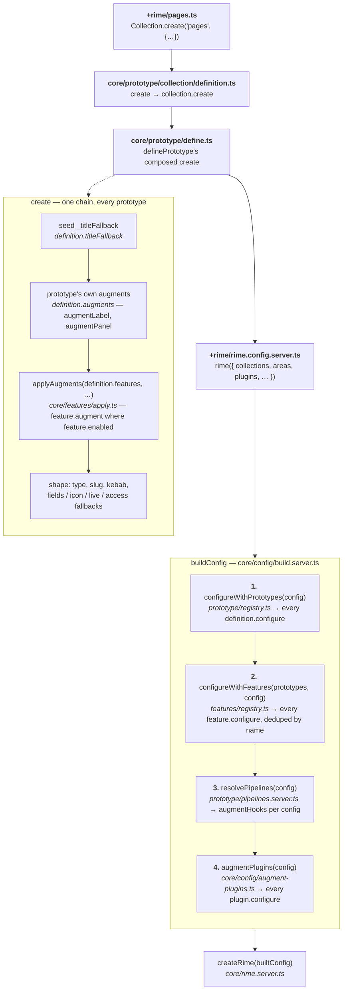
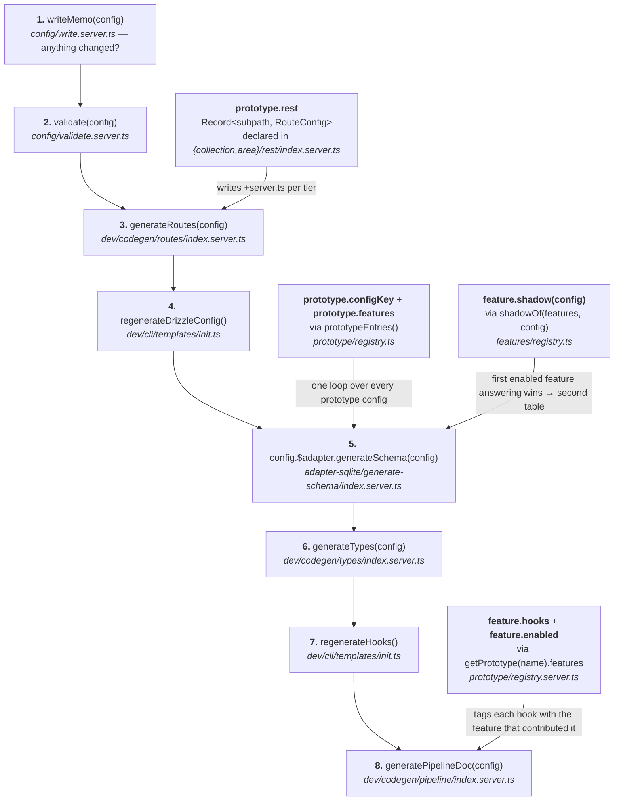
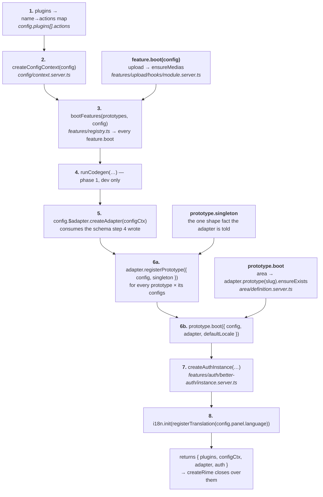
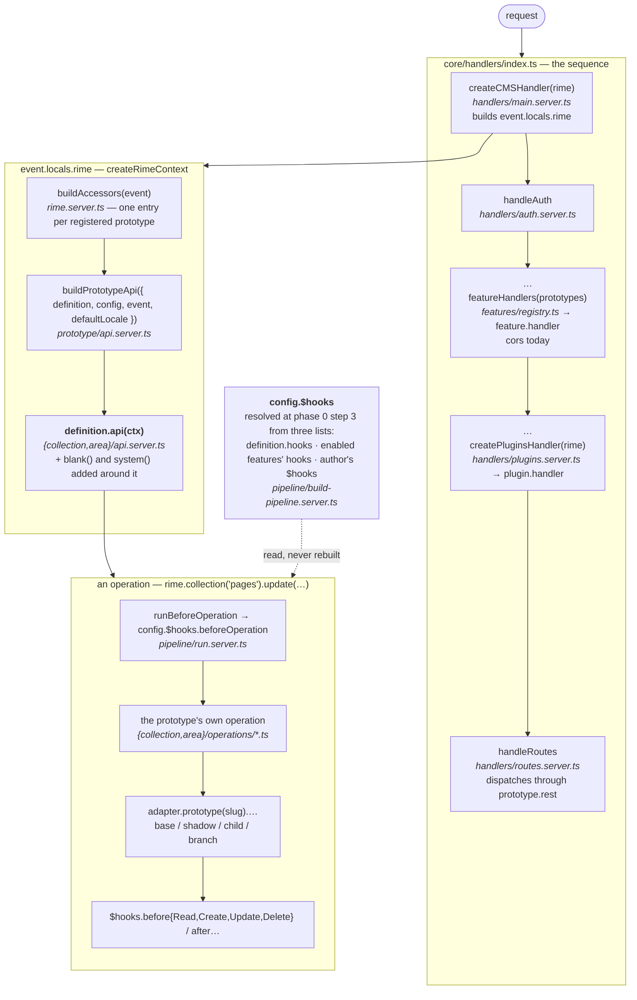

# Architecture target

> **Status: mostly landed.** `definePrototype`, `defineFeature` and `definePlugin` all exist;
> `name`, `configKey`, `titleFallback`, `singleton`, `features`, `augments`, `hooks` and
> `configure` are declared members, and `definePrototype` composes each prototype's `create` from
> them; a feature carries `augment`, `configure`, `shadow`, `handler`, `boot`, `validate`, `blank`
> and `hooks`. The
> adapter speaks base/shadow/child/branch and `adapter.{collection,area}` is gone.
>
> Three things below have **not** landed, and two of them turned out to be wrong:
>
> - **"No `derive`, `augment`, …"** — `augment` stayed, and it is the right primitive: a feature
>   adding fields to a prototype's config is not the same act as one adding a whole collection.
>   `derive` did go: what was `versions.derive` / `upload.derive` is now `configure`, the
>   whole-config step, so there is one seam instead of two. See `restructure-handoff.md` rule 6.
> - **`rime.{prototypeName}(slug)`** — accessors _are_ generated per prototype
>   (`prototype/accessors.server.ts`, built by `buildAccessors` in `rime.server.ts`), so the shape
>   landed; the names are still `collection` and `area` because those are the two registered, and
>   `is('singleton')` does not exist — `singleton` is on the definition, which is what the adapter
>   reads.
> - **`extends('prototypeName')`** — a feature does not declare which prototypes it extends; the
>   prototypes list the features. That direction is deliberate: a prototype's `features` list is
>   also its _order_, and order is the thing a feature cannot know.
>
> `isArea` / `isCollection` and the quoted kind names are down to **32 lines in core**, 1 in the
> adapter and 4 in fields, with **35 in the panel** — where some kind-shaped branch legitimately
> survives (`coupling-audit.md` §5). Core's concentrate in `config/{context,build,validate}.server.ts`
> and `config/types.ts`.
>
> The sections below are the **real** contracts and the **real** flow, read off the code. The
> original sketch's unbuilt ideas are preserved at the end, marked as such.

---

## 1. The three layers

| layer         | verb                   | scale                                                | contract          |
| ------------- | ---------------------- | ---------------------------------------------------- | ----------------- |
| **prototype** | _defines_              | the base thing itself                                | `definePrototype` |
| **feature**   | _augments and extends_ | large — across prototypes, adds shadows and children | `defineFeature`   |
| **plugin**    | _augments_             | small                                                | `definePlugin`    |

- A **prototype** owns a `base` table and carries the `singleton` flag. An area is a prototype with
  singleton on — create and delete are off, reads and updates take no id. A collection is a
  prototype with singleton off. Neither is a discriminator on one implementation: they are two
  definitions built to the same pattern.
- A **feature** extends what a prototype defines. `type` says what it does to the database:
  `augment` (nothing — it only changes a config), `shadow` (deviates the prototype's own table),
  `child` (a table owned by the prototype's rows). Only `augment` and `shadow` have inhabitants
  today.
- A **plugin** augments the whole config and can contribute actions, routes and a handler. It never
  touches a prototype config.

> The adapter understands the prototype definition and the contract it brings with it —
> [`decoupling-adapter.md`](decoupling-adapter.md).

---

## 2. The three phases, and where each layer is injected

Three phases, in this order, and the middle one contains the first: `createRime` calls `bootRime`,
which calls `runCodegen` at step 4 (dev only). Everything after that is per request.

### Phase 0 — the config chain

Not a phase of its own: it is the argument `createRime` is called with. `rime(config)` is
`buildConfig` and it runs four steps, none of which names a feature or a kind.



Two things the picture is making a point of:

- **`configure` is the only seam for whole-config work**, and both layers above the config use it:
  a prototype defaults its own list (`config.collections ||= []`), `auth` derives the `staff`
  collection, `upload` derives `<slug>Directories`, `versions` derives the `__versions` aliases,
  `cors` defaults `$trustedOrigins`. The runtime order is the prototypes' own `features` lists;
  nothing type-level replays it, because every declared `configure` transform is additive and the
  order does not change the result. `ConfigureTransforms` in `features/register.ts` names the
  declarations for the type fold — `features/registry.spec.ts` asserts both that they are additive
  and that the list is complete.
- **Pipelines are resolved once, at step 3**, after the features have derived everything. A derived
  config is resolved by the same line as an authored one, which is why nothing carries a second
  copy of a pipeline.

The client chain is the same minus step 3 — `buildConfigClient` in `core/config/build.ts`. Nothing
client-side runs a document hook.

### Phase 1 — codegen (dev only)

`runCodegen`, in `core/codegen.server.ts`, called from inside boot at step 4. Each step's output is
the next step's input _on disk_, which is why it is a numbered sequence and not a list of hooks.



`generate-schema` is the worked example of a fold that names no kind: `prototypeEntries(config)`
gives it every prototype config paired with its definition, and `shadowOf(entry.prototype.features,
config)` asks the features — not the config — where the content lives.

### Phase 2 — boot

`bootRime`, in `core/boot.server.ts`. A chain with data flow rather than uniform transforms, so it
is numbered: the config context feeds the adapter, the adapter feeds better-auth.



Note which registry each step reads. `boot.server.ts` imports `prototypes` from
**`registry.server.ts`** — the halves carrying `boot`, `api` and `rest`. The isomorphic
`registry.ts` carries `singleton` and `features` but no `boot`, and reading it here meant an area's
row was never created and every area read 404'd.

### Phase 3 — runtime

Two entry points per request: the handler chain, and `event.locals.rime`.



A feature contributes to a request in exactly three ways, and all three are visible above:
`handler` (the whole request), `hooks` (the document pipeline, already resolved into `$hooks`), and
whatever its `augment` put on the config the operation reads.

### The injection table

Every place a prototype or a feature reaches into rime, what carries it, and who calls it.

| what                          | declared on      | injected by                                                         | from                                               | into                                    |
| ----------------------------- | ---------------- | ------------------------------------------------------------------- | -------------------------------------------------- | --------------------------------------- |
| prototype's own augments      | `augments`       | the composed `create`                                               | `prototype/define.ts`                              | a prototype config, before the features |
| feature fields / normalising  | `augment`        | `applyAugments(features, config)`                                   | `features/apply.ts`                                | a prototype config, in list order       |
| whether a feature applies     | `enabled`        | `applyAugments`, `buildPipeline`, `shadowOf`                        | three call sites                                   | asked of a **config**, never of a kind  |
| prototype's own list default  | `configure`      | `configureWithPrototypes`                                           | `prototype/registry.ts`                            | the whole config                        |
| derived collections, defaults | `configure`      | `configureWithFeatures`                                             | `features/registry.ts`                             | the whole config                        |
| document hooks                | `hooks`          | `buildPipeline` → `augmentHooks`                                    | `pipeline/build-pipeline.server.ts`                | `config.$hooks`, once, at build time    |
| the second table              | `shadow`         | `shadowOf(features, config)`                                        | `features/registry.ts`                             | `generate-schema`, and registration     |
| one-off setup                 | `boot`           | `bootFeatures` / the boot loop                                      | `features/registry.ts`, `boot.server.ts`           | phase 2, steps 3 and 6b                 |
| how many rows                 | `singleton`      | `adapter.registerPrototype`                                         | `boot.server.ts` step 6a                           | the adapter                             |
| request middleware            | `handler`        | `featureHandlers(prototypes)`                                       | `features/registry.ts`                             | the handler chain                       |
| the REST surface              | `rest`           | `generateRoutes`, `handleRoutes`                                    | `dev/codegen/routes/`, `handlers/routes.server.ts` | `/api` files and their dispatch         |
| the local API                 | `api`            | `buildPrototypeApi`                                                 | `prototype/api.server.ts`                          | `rime.<name>(slug)`                     |
| the config member             | `configKey`      | `prototypeConfigs` / `prototypeEntries`                             | `prototype/registry.ts`                            | every "iterate every prototype config"  |
| the built config's `type`     | `name`           | the composed `create`                                               | `prototype/define.ts`                              | `config.type`, which pairs it back      |
| type-level transforms         | `declare module` | `ApplyPrototypeConfigure`, `ApplyAugments`, `ApplyFeatureConfigure` | `prototype/register.ts`, `features/register.ts`    | the config's **type**                   |

---

## 3. The real contracts

### `PrototypeDefinition` — `core/prototype/define.ts`

```ts
export type PrototypeDefinition<C extends BuiltPrototype = BuiltPrototype, Accessor = unknown> = {
  /** The kind's name, and the `type` every config it builds carries. */
  name: string;
  /** Whether exactly one document exists. The one shape fact the adapter is told. */
  singleton: boolean;
  /** The features that extend it, **in the order their augments run** — which is column order. */
  features: FeatureDefinition[];
  /** The prototype's own augments, ahead of every feature's. */
  augments?: readonly ((config: any) => any)[];
  /** The config member its instances are authored under — `collections`, `areas`. */
  configKey: string;
  /** What a document is called when no field is marked as the title. */
  titleFallback: string;
  /** Its *own* document hooks — unconditional, and free of conditionals. */
  hooks?: Partial<Record<HookTiming, AnyHook[]>>;
  /** What it adds to the **whole** config, rather than to one config of its own kind. */
  configure?: (config: any) => any;
  /** Composed by `definePrototype`, never passed in. */
  create: (slug: string, config: Dic) => C;
  /** Once per process, per config of this kind. */
  boot?: (args: PrototypeBootArgs<C>) => Promise<void>;
  /** The local API — what `rime.<name>(slug)` hands back. */
  api?: (ctx: PrototypeApiContext<C>) => Dic;
  /** The REST surface, keyed by sub-path under `/api/[slug=<name>]`. */
  rest?: Record<string, RouteConfig>;
  /** Type-only phantom: the accessor this definition contributes to `event.locals.rime`. */
  readonly $InferAccessor: Accessor;
};

export const definePrototype = <C extends BuiltPrototype = BuiltPrototype, Accessor = unknown>(
  options: Partial<Omit<PrototypeDefinition<C>, '$InferAccessor' | 'create'>> = {}
): PrototypeDefinition<C, Accessor> => {
  /* composes `create`, defaults the rest */
};
```

`RegisteredPrototype` is an alias for `PrototypeDefinition`, not an intersection: `name` is on the
definition, so the registries hand back the definitions themselves.

### `FeatureDefinition` — `core/features/define.ts`

```ts
export type FeatureDefinition = {
  /** Identifies it in the generated pipeline, and dedupes the whole-config steps. */
  name: string;
  /** What it does to the database — `augment` touches none, `shadow` deviates one, `child` adds one. */
  type: 'augment' | 'shadow' | 'child';
  /** Features it is built on, by name. Also an ordering statement. */
  requires: string[];
  /** Whether a given config uses it — the one place that question is answered. */
  enabled: (config: Dic) => boolean;
  /** What it adds to a config of a prototype that lists it. Runs in the prototype's order. */
  augment?: (config: any) => any;
  /** The table it deviates a config's content into, or `undefined`. */
  shadow?: (config: any) => ShadowDeclaration | undefined;
  /** What it adds to the **whole** config — derived collections, defaults. */
  configure?: (config: any) => any;
  /** A SvelteKit handler, run between `handleAuth` and the plugins'. */
  handler?: Handle;
  /** Once per process. */
  boot?: (config: any) => void | Promise<void>;
  /** What it requires of a config that uses it — asked only where `enabled`. */
  validate?: (config: any) => string[];
  /** What it takes off, or adds to, the blank document the local API hands out. */
  blank?: (doc: any, config: any) => any;
  /** Document hooks, by timing. Where they land in the pipeline is not its business. */
  hooks?: FeatureHooks;
};

export type ShadowDeclaration = { slug: string };
export type FeatureHooks = Partial<Record<HookTiming, AnyHook[]>>;
export type HookTiming =
  | 'beforeOperation'
  | 'beforeRead'
  | 'beforeCreate'
  | 'afterCreate'
  | 'beforeUpdate'
  | 'afterUpdate'
  | 'beforeDelete'
  | 'afterDelete';

/** Generic in the *name only*, so `name` survives as a literal for the type fold. */
export const defineFeature = <N extends string>(
  definition: FeatureDefinition & { name: N }
): FeatureDefinition & { name: N } => definition;
```

There is no `extends`, and no `beforeBoot` / `afterBoot` / `beforeCodegen` / `afterCodegen` /
`persistence` / `transform`. Only the members some feature actually uses are declared; the rest
land when a feature needs them.

### `Plugin` — `core/plugins/index.ts`

```ts
export type Plugin = {
  name: string;
  /** One step, both sides: run over a full `Config` on the server and a `SanitizedConfigClient` on the client. */
  configure?: <const C extends Config | SanitizedConfigClient>(config: C) => C;
  actions?: Record<string, (...args: any[]) => any | Promise<any>>;
  routes?: Record<string, RouteConfig>;
  handler?: Handle;
};

export function definePlugin<const F extends (options?: any) => Plugin>(factory: F): F {
  return factory;
}
```

A plugin is a **factory** — `definePlugin(() => ({ … }))` — because a consumer passes options at
the call site in their config.

---

## 4. The real definitions

### A prototype

```ts
// core/prototype/collection/definition.ts — the isomorphic half
export const collection = definePrototype({
  name: 'collection',
  singleton: false,
  configKey: 'collections',
  titleFallback: 'id',
  augments: [augmentLabel, augmentPanel],
  features: [auth, panel, upload, nested, versions, url, title, thumbnail, metas, cors],
  configure: <T extends { collections?: BuiltCollection[] }>(config: T) => ({
    ...config,
    collections: config.collections || []
  })
});

/** Public authoring API. The signature lives here because it is generic in the slug. */
export const create = <S extends string>(
  slug: S,
  config: CollectionWithoutSlug<S>
): BuiltCollection => collection.create(slug, config) as BuiltCollection;

declare module '$lib/core/prototype/register.js' {
  interface PrototypeConfigure<T> {
    collection: T & { collections: BuiltCollection[] };
  }
}
```

```ts
// core/prototype/collection/definition.server.ts — the server half
export const collection = definePrototype<BuiltCollection, CollectionAccessor>({
  ...base,
  api: (ctx) => api(ctx),
  rest,
  hooks: collectionHooks
});
```

The area is the same file shape with `singleton: true`, `configKey: 'areas'`,
`augments: [augmentAreaLabel]`, a shorter `features` list — no `auth`, `upload`, `nested` or
`thumbnail`, because an area is one document — and a `boot` that calls
`adapter.prototype(config.slug).ensureExists(…)`.

Two rules the split encodes, both of which cost a round:

- **A feature must not import `definition.server.ts`.** It spreads `{ ...base }` at module scope;
  entered in the wrong order the spread arrives without `features` and every feature hook silently
  stops running. `auth`'s `augmentStaff` imports the isomorphic `definition.ts`.
- **A feature's `index.ts` must not import its own `.server.ts` hooks.** The `features` list is
  reachable from a client build, so a hook imported by path lands in the browser graph and
  SvelteKit refuses it. Hooks go in a `hooks/module.server.ts` with no `module.ts` beside it,
  reached through `$rime/modules`.

### A feature that exercises the whole contract

```ts
// core/features/upload/index.ts
import { augmentUpload, bootUpload, configureUploadDirectories, uploadHooks } from '$rime/modules';

export const upload = defineFeature({
  name: 'upload',
  type: 'augment',
  requires: [],

  /** A config uses this feature by declaring `upload`. */
  enabled: (config) => !!config.upload,

  augment: augmentUpload, // fields; the server half adds `_path`'s foreign key
  configure: configureUploadDirectories, // derives the `<slug>Directories` collection
  boot: bootUpload, // ensures the static directory exists
  hooks: uploadHooks // four timings
});

/** Turns an author's `upload: true` into a normalised object — the *type* half of `augment`. */
declare module '$lib/core/features/register.js' {
  interface FeatureConfigAugment<T> {
    upload: WithNormalizedUpload<T>;
  }
}
```

Everything server-varying arrives through `$rime/modules`, so this stays one definition rather than
a pair that has to be kept in step.

### A `shadow` feature

```ts
// core/features/versions/index.ts
export const versions = defineFeature({
  name: 'versions',
  type: 'shadow',
  requires: [],
  enabled: (config) => !!config.versions,

  augment: augmentVersions, // isomorphic: normalises `versions`, adds `status`

  /** Identity and `._root()` fields stay on the base row; everything else moves here. */
  shadow: (config) => ({ slug: withVersionsSuffix(config.slug) }),

  /** The `<slug>__versions` aliases, derived after upload has derived its directories. */
  configure: makeVersionsCollectionsAliases
});

declare module '$lib/core/features/register.js' {
  interface FeatureConfigAugment<T> {
    versions: WithVersionsConfig<T>;
  }
}
```

`shadow` is what makes `type: 'shadow'` mean something: the adapter builds the second table from
what is declared here, not from a member it recognises by name. It is asked of a **config**, gated
by `enabled` — so a prototype with versions on one collection and not the next gets a shadow for
the first alone.

`versions` deliberately carries **no `hooks`**: its two `beforeUpdate` hooks run for every config,
versioned or not (`assertUpsertContext` requires what `defineVersionOperation` populates), so
`enabled` would break updates on non-versioned configs. The prototypes list them by name until
there is a timing that means "always" — the last place a prototype names a feature.

### A feature that is a handler

```ts
// core/features/cors/index.ts
export const cors = defineFeature({
  name: 'cors',
  type: 'augment',
  requires: [],
  enabled: () => true,

  configure: augmentCORS, // the `$trustedOrigins` default
  handler: handleCORS // and the handler that enforces it
});

declare module '$lib/core/features/register.js' {
  interface FeatureConfigure<T> {
    cors: T & { $trustedOrigins: string[] };
  }
}
```

Both halves of one idea, which is what makes it a feature rather than two unrelated lines. Note
`FeatureConfigure` for a whole-config transform versus `FeatureConfigAugment` for a per-config one
— two declaration-merging targets, folded by two different steps.

### The smallest feature

```ts
// core/features/title/index.ts
import { titleHooks } from '$rime/modules';

export const title = defineFeature({
  name: 'title',
  type: 'augment',
  requires: ['upload'], // both resolve `asTitle`; upload's fallback has to be in place first
  enabled: () => true,
  augment: augmentTitle,
  hooks: titleHooks // { beforeRead: [setDocumentTitle] }, server-only
});

declare module '$lib/core/features/register.js' {
  interface FeatureConfigAugment<T> {
    title: T & { asTitle: string };
  }
}
```

### A plugin

```ts
// core/plugins/sse/module.server.ts
export const sse = definePlugin(() => {
  const requestHandler: RequestHandler = async ({ locals }) => {
    /* … opens the event stream … */
  };

  return {
    name: 'sse',
    actions: { broadcast }, // → rime.sse.broadcast(…)
    routes: { '/api/sse': { GET: requestHandler } }
  } as const satisfies Plugin;
});

/** What `$InferPluginsServer` picks up, so `rime.sse` is typed. */
export type SSEActions = { broadcast: typeof broadcast };
```

A plugin's `routes` key is an **absolute** pathname; a prototype's `rest` key is a sub-path under
`/api/[slug=<name>]`. A prototype has no URL of its own to name — its slugs come from the user's
config, and the param matcher is what turns one into a route.

---

## 5. Where hooks come from, and who orders them

A config's `$hooks` is built once, by `buildPipeline`, out of three lists — and **nothing declares
where its hooks go**:

```ts
// core/pipeline/build-pipeline.server.ts, per timing
const own = definition.hooks?.[timing] ?? [];
const fromFeatures = active.flatMap((feature) => feature.hooks?.[timing] ?? []);
const hooks = [...own, ...fromFeatures, ...(consumer?.[timing] ?? [])];

pipeline[timing] = resolvePipeline({ hooks, label: `${config.type} ${config.slug} ${timing}` });
```

The list order is only the **tie-break**. `resolvePipeline` decides the rest from the marks each
hook declares — `requires` and `provides` — which is what lets `auth`'s `removePrivateFields` be
first in `beforeRead` by saying it provides `sanitized`, rather than by being written first.

Two consequences that raise no error when broken:

- `HookMark` is a **closed union**, extended by features through declaration merging. A typo'd mark
  is vacuously satisfied and reorders the pipeline silently. `core/pipeline/pipeline-order.spec.ts`
  is the gate.
- A mark nothing active provides is satisfied, which is what lets one declaration be correct in
  both `beforeCreate` and `beforeUpdate`.

`hooks.generated.md` renders the resolved order as a tree, tagged by contributing feature. It is
built from the config, not from what boots — so it is a reading aid, not a gate.

---

## 6. From the original sketch, not built

Kept verbatim in intent, because these are still the direction — none of them has an inhabitant
today, and the contract does not declare them.

**`type: 'child'`** — a table owned by the prototype's rows, `{base}__$relation`, and
`{base}__{shadow}__$relation` when the prototype has a shadow. Blocks and relations are the two
candidates; both are currently persisted by `core/pipeline/persist/` rather than by a feature.

```ts
const relations = defineFeature({
  name: 'relation',
  type: 'child',
  hooks: {
    persistence: [getRelationDiff, saveChildRows], // on update / create
    transform: [({ document, configMap }) => transformDocument(document)]
  }
});
```

**Boot and codegen hook timings** — `beforeBoot`, `afterBoot`, `beforeCodegen`, `afterCodegen`.
Today a feature gets one `boot(config)` and nothing at codegen. `HookTiming` is document-only.

**`extends: ['collections', 'areas']`** — deliberately inverted, as the status note says. A feature
does not name the prototypes it extends; the prototypes list the features, because a prototype's
`features` list is also its column order and a feature cannot know that.

**`api` on a feature** — what would go into `rime.<prototypeName>`, so that upload's directories
could contribute `rime.collection('medias').isDirectory()`. There is no feature-contributed API
member today; a prototype's `api` is the only one.

**`rime.<prototypeName>(slug).is('singleton')`** — accessors are per prototype already
(`buildAccessors`), but a built config carries `singleton` on its definition, not a predicate on
its API.

**A feature-shaped `auth`** — the sketch ends "I think auth is core not a feature full stop",
because better-auth's instance needs the adapter and contributes a member back. It **is** a feature
now, with one exception: its better-auth construction is still step 7 of `bootRime` rather than its
`boot`, because `boot` takes only the config and cannot contribute anything back. That is item 8 of
`cold-start.md` §4 — a contract change, not a relocation.
