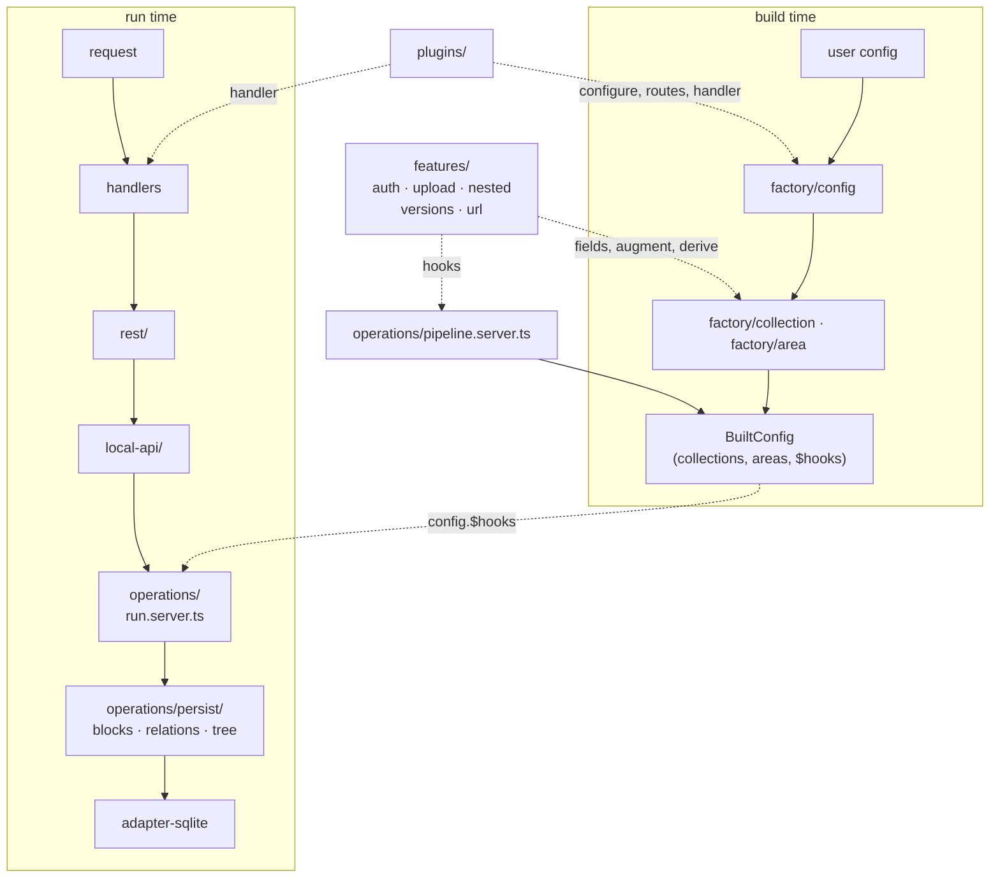

# `src/lib/core` — structure audit & target

> Status: **applied**, over two rounds. Sections 3 and 4 describe the layout as it was
> _before_ the change and are kept as the record of why it moved; section 0 describes where it
> landed, including the placement rule that came out of the second round.

## 0. Outcome

`ls src/lib/core` before → after:

```
areas/  collections/  config/  operations/     constants.ts  constants.server.ts  logger.server.ts
dev/  errors/  fields/  handlers/  i18n/    →  errors/  i18n/  fields/  prototype/
logger/  plugins/  types/                      factory/  operations/  features/
                                               rime/  rest/  handlers/  plugins/  dev/
```

Two directories are gone (`collections/`, `areas/`), and every entry left is a concept with a
real name — no `shared/`, no `types/`, no `naming.ts` grab-bag.

### The placement rule

The recurring question behind most of this was _"what is core, what is util?"_ — and the honest
answer for a long time was "wherever it landed". The rule now is:

| bucket                  | test                                                                   | examples                                            |
| ----------------------- | ---------------------------------------------------------------------- | --------------------------------------------------- |
| `util/`                 | imports **nothing** from rime; pure functions over language primitives | `string`, `object`, `path`, `coerce`                |
| `core/<concept>/`       | rime vocabulary, or always-on infrastructure                           | `prototype`, `fields`, `errors`, `i18n`             |
| `core/features/<name>/` | **`pipeline.server.ts` branches on it**                                | `auth`, `upload`, `nested`, `versions`, `url`       |
| `core/<layer>/`         | a stage of the flow                                                    | `factory`, `operations`, `rime`, `rest`, `handlers` |

Read the signature: if every type in it is a language type, it is a util; if any type is a rime
type, it belongs to that type's concept. `toKebabCase(s: string)` → util.
`withVersionsSuffix(slug: CollectionSlug)` → versions. `isStaff(user: User)` → auth.

Two clarifications make it workable:

- **A barrel is not a home.** `util/index.ts` still publishes `access`, `validate` and `doc`
  because `rimecms/util` is public API for config authors; where that code _lives_ is a separate
  question, and it lives with its concept.
- **The feature test is mechanical, not a matter of taste.** It is what
  `pipeline.server.ts` branches on. That settles localization: nothing branches on it,
  `setDocumentLocale` runs unconditionally and every table gets the `Locales` treatment, so it
  is infrastructure and `withLocalesSuffix` sits in `core/i18n/` — not a feature folder.

Applying the rule paid for itself: splitting `util/doc.ts` (document builders → `prototype/`,
path helpers → `util/path.ts`, `ensurePathExists` → `util/object.ts`) removed a real circular
dependency. **Madge is at 6, down from 7.**

Two things came out simpler than round 1 planned:

- **`augment-title` needed no `titleFallback` parameter.** The area variant is the collection
  one minus branches that cannot fire on an area, so one file covers both.
- **`operations/` kept a `collection/` and `area/` split.** `runUpdate` removed the duplicated
  _pipeline_; what is left per file is genuinely per-prototype.

### Four inconsistencies, settled

Round 1 preserved these verbatim and flagged them; round 2 settled them. The first took two
attempts and is the interesting one.

1. **Create chains the hook config, like update.** The `chainConfig` flag is gone.

   The first attempt failed e2e (`tests/basic` "Should not create a user" expected 403, got 400)
   and was reverted with a comment arguing the flag was deliberate. That comment was wrong. The
   real cause was two fields away:

   - `confirmPassword` was declared with no `.access()`, so it kept `FormFieldBuilder`'s
     constructor default `create: (user) => !!user`. On an anonymous `POST /api/users` it was
     stripped by `validateFields`' access block.
   - `validateFields` then applied `required` to the value that block had just emptied,
     reporting `REQUIRED_FIELD` → 400, before `createBetterAuthUser` could reach its 403.

   Not chaining had merely been hiding that, at the cost of making `augmentFieldsPassword` dead
   code on create: it ran, built an amended config, and had it discarded, so **no create path
   ever enforced the password policy**. Both bugs are fixed below, and chaining now works.

   Ordering is load-bearing: `augmentFieldsPassword` must run _after_ `mergeWithBlankDocument`.
   The blank document is built from `config.fields` and the config map from the _data_, so
   augmenting first gives every create a blank `password` that fails its own `.required()` —
   including better-auth's post-signup callback, which legitimately creates the document with
   `{ name, email, authUserId }` and no password.

2. **`afterUpdate` returns what its hooks handed back**, matching `afterCreate`.
3. **`transform.doc` moved inside the per-document `try/catch`** in `find()`.
4. **The inference guard covers the core plugins**, not just slug literals.

### Two bugs found underneath #1

Both were pre-existing, and neither is auth-specific.

- **`confirmPassword` is no longer a document field.** It is a form control: comparing two
  values the same client just sent proves nothing server-side, and modelling it as data is what
  forced `restCreate` to fake it (`data.confirmPassword = data.password`) before every API
  create. `augmentFieldsPassword` now appends `password` only, the fake is deleted, and the
  panel keeps the match check where a typo can still be corrected (`AuthFooter.svelte`).

- **`required` no longer fires on a field the request may not write.** A field emptied by the
  access block cannot be supplied by the caller, so demanding it is an unsatisfiable 400. This
  reaches well past auth: with `access.create` defaulting to `(user) => !!user`, _any_
  publicly-creatable collection — a sign-up, a contact form — 400s on every `.required()` field
  that does not explicitly override it. No e2e fixture covers this (they all declare
  `create: () => true` on the fields they post), so it is guarded by
  `operations/steps/validate-fields.spec.ts`, verified to fail without the fix.

### Verification

`svelte-check` 0 errors, `vitest` 90/90, `madge` 6 cycles. `bun run test` (375 e2e tests across
six suites) passed at the end of round 1, and is what surfaced the config-chaining regression;
the changes above still want a full run.

Reproducing `bun run test` needs `.env` per CONTRIBUTING plus an SMTP server at
`RIME_SMTP_HOST` speaking implicit TLS with a trusted certificate: creating an API key really
does send mail.

## 1. Scope & method

Read in full: every directory under `src/lib/core`, plus the entry points
(`src/lib/{index,server,types}.ts`), `package.json`, `svelte.config.js`,
`vite.config.ts`, and the generated-type / generated-route machinery under
`core/dev`.

**Out of scope — these stay intact:**

|                                                           | why                                                               |
| --------------------------------------------------------- | ----------------------------------------------------------------- |
| `src/lib/adapter-sqlite/`                                 | Coherent already: one file per concern, one entry point.          |
| `src/lib/fields/`                                         | The vertical slice this proposal wants to generalise, not change. |
| `src/lib/panel/`                                          | Separate axis (UI), separate problem.                             |
| `src/lib/util/`, `src/lib/core/{dev,i18n,logger,errors}/` | Leaf infrastructure, no cross-cutting.                            |

`core/fields/builders/` also stays where it is. It holds `FieldBuilder`,
`FormFieldBuilder`, `BooleanFieldBuilder`, `PickOne/PickManyFieldBuilder` — the
base classes every field in `src/lib/fields/*` extends. This is the one place
where "builder" is the correct word, and it is imported from `fields/`,
`panel/`, `adapter-sqlite/` and `core/` alike.

## 2. The problem, in one sentence

`ls src/lib/core` tells you **what kind of thing** a file is. It never tells you
**where that thing sits in the request flow**.

---

## 3. The layout before

```
src/lib/core/                            LOC   files
├── collections/                        4090     65   ← prototype + layer + feature, all three
│   ├── config/                                  17     the factory (create()) + 14 augments
│   ├── operations/                               7     create, find, findById, updateById, delete…
│   ├── rest/                                     8     HTTP adapters over local-api
│   ├── auth/          hooks/ ×7 timing dirs     14     FEATURE
│   ├── upload/        hooks/ disk/ util/        16     FEATURE
│   ├── nested/        hooks/index.server.ts      1     FEATURE
│   ├── versions/      operations.ts              1     FEATURE
│   └── local-api.server.ts
├── dev/                                 4088     23   CLI, codegen, vite plugin — coherent
├── operations/                          2182     31
│   ├── hooks/         before-* ×5 timing dirs   17     generic pipeline steps + the Hook types
│   ├── blocks/ relations/ tree/                  9     relational persistence
│   ├── configMap/                                3
│   └── extract-data.server.ts                          ← parses a Request body
├── config/                              1898     27
│   ├── client/ server/ shared/                  22     the global buildConfig pipe
│   └── auth/          better-auth-*.ts           3     ← auth, part 2
├── fields/                              1109      7   builder base classes + util
├── areas/                                713     14   config/ operations/ rest/ — collections, again
├── plugins/                              640     16   definePlugin + cache, sse, mailer, api-init
├── handlers/                             468      6   the SvelteKit handle chain
├── i18n/ errors/ logger/ types/          810     15
├── rime.server.ts  constant.ts  constant.server.ts  naming.ts  ensure.server.ts
```

Three orthogonal axes are braided into that one tree:

- **prototype** — `collections/`, `areas/`
- **layer** — `config/` (factory), `local-api`, `rest/`, `operations/`
- **feature** — auth, upload, nested, versions, url

Every feature is smeared across the other two axes. That is the whole finding;
everything below is a consequence.

---

## 4. Findings

### 4.1 Hooks live in four places, in four different conventions

| where                                           | count | convention                                          |
| ----------------------------------------------- | ----- | --------------------------------------------------- |
| `core/operations/hooks/before-*/`               | 16    | grouped into 5 timing directories                   |
| `core/collections/auth/hooks/{before,after}-*/` | 9     | grouped into 7 timing directories, one level deeper |
| `core/collections/upload/hooks/*.server.ts`     | 7     | flat, no timing directories                         |
| `core/collections/nested/hooks/index.server.ts` | 1     | one hook, in a `hooks/` directory, named `index`    |

Same kind of object, four shelvings. Finding the hook you want means knowing in
advance which of the four schemes its author picked.

### 4.2 The one file where the flow _is_ legible is filed under "config"

`collections/config/augment-hooks.server.ts` is the real pipeline definition —
the only place in the codebase where you can read every hook and its order:

```ts
beforeRead: [
  ...(collection.auth ? [removePrivateFields] : []),
  processDocumentFields,
  setDocumentTitle,
  setDocumentLocale,
  setDocumentType,
  ...(collection.upload  ? [populateSizes]      : []),
  ...(collection.$url    ? [populateURL]        : []),
  ...(collection.nested  ? [addChildrenProperty]: []),
  setDocumentThumbnail,
  sortDocumentProps
],
```

Nothing in the path `collections/config/augment-hooks.server.ts` suggests this is
where the flow is written down. It also exists twice — `areas/config/augment-hooks.server.ts`
is the same file with the feature branches deleted — so the two pipelines can
drift without anyone noticing.

**This file's shape is an asset and the target must preserve it.** See §7.

### 4.3 `operations` names four different things

- `core/operations/` — the shared pipeline internals
- `core/collections/operations/` — collection entry points
- `core/areas/operations/` — area entry points
- `core/collections/versions/operations.ts` — version _strategy_ constants
  (`UPDATE_PUBLISHED`, `NEW_DRAFT_FROM_PUBLISHED`, …), a completely unrelated sense

And `core/operations/` is itself four unrelated concerns in one folder:

| path                              | actually is                                                                                                    |
| --------------------------------- | -------------------------------------------------------------------------------------------------------------- |
| `hooks/index.server.ts` (217 LOC) | the `Hook` / `HookContext` / `OperationContext` **type definitions** plus the `Hooks` factory — no hooks in it |
| `hooks/before-*/`                 | the generic pipeline **steps**                                                                                 |
| `blocks/ relations/ tree/`        | **relational persistence** (extract → diff → write), called by every write op                                  |
| `extract-data.server.ts`          | **HTTP body parsing** (`multipart/form-data`, JSON) — not an operation at all                                  |

### 4.4 `areas/` is `collections/` copy-paste

Byte-identical apart from the generic parameter:

- `augment-metas.ts` — differs only in `Area<any>` vs `Collection<any>`
- `augment-url.ts` — same
- `augment-versions.ts` — same, and both carry the same doc comment; the only
  textual difference is a typo (`drat` in the area copy, `draft` in the
  collection copy)

Structurally identical:

- `areas/operations/update.ts` vs `collections/operations/updateById.ts` — the
  same eight steps written twice:
  `beforeOperation hooks → beforeUpdate hooks → assert context → adapter write →
saveBlocks → saveTreeBlocks → saveRelations → re-read → afterUpdate hooks`
- `areas/rest/update.server.ts` vs `collections/rest/updateById.server.ts` — same
  guard / `extractData` / `setLocale` / `trycatch` / `json` shape
- `areas/local-api.server.ts` vs `collections/local-api.server.ts` — same facade

Genuinely different, and worth keeping different: `augment-title.ts` (a collection
falls back to `filename` for upload, `email`/`name` for auth; an area falls back
to `id`), and the fact that areas have no create/delete.

### 4.5 An unnamed concept: **derived collections**

Three places synthesize collections the user never wrote, each in a different
home, none of them naming the shared idea:

| what               | where                                         | derives                         |
| ------------------ | --------------------------------------------- | ------------------------------- |
| versions           | `config/shared/versions-alias.server.ts`      | `pages` → `pages_versions`      |
| upload directories | `config/server/augment-directories.server.ts` | `medias` → `medias_directories` |
| staff              | `config/shared/get-staff-collection.ts`       | the panel-users collection      |

`augment-directories.server.ts` even hand-wires a second, private hook pipeline
(`exctractPath`, `prepareDirectoryChildren`, `updateDirectoryChildren`) that
never appears in `augment-hooks.server.ts` — a second big picture, hidden in a
file named after config augmentation.

### 4.6 Auth has no single home

Auth is currently three separate things in three separate trees:

| tree                                              | what it is                                                                                                                            |
| ------------------------------------------------- | ------------------------------------------------------------------------------------------------------------------------------------- |
| `core/config/auth/` (3 files)                     | the **better-auth integration** — instance config, permissions, better-auth's own hooks. Transversal, built once in `rime.server.ts`. |
| `core/collections/auth/` (14 files)               | the **per-collection capability** — fields, private-field constants, 9 hooks, util, types.                                            |
| `config/{shared,client,server}/*staff*` (3 files) | the **staff collection derivation**.                                                                                                  |

This split is not arbitrary — the first really is a different kind of thing from
the second. But nothing in the layout says so, and "where does auth live?" has no
answer today. §6.3 gives it one.

### 4.7 Mixed file-naming conventions

`buildTreeMap.ts`, `deleteById.ts`, `findById.ts`, `updateById.ts` (camelCase)
sit beside `populate-url.server.ts`, `merge-with-blank.server.ts`,
`augment-hooks.server.ts`, `set-default-values.server.ts` (kebab-case). The split
is roughly "files named after a method" vs "files named after a step", but it is
not applied consistently and there is no stated rule.

### 4.8 Single-file folders wrapped in ceremony

`collections/nested/hooks/index.server.ts` (one hook), `collections/versions/operations.ts`
(one folder, one file), `collections/config/types.ts` (one 4-line type),
`core/types/index.ts` (7 lines).

---

## 5. What already works — generalise these, don't replace them

**`src/lib/fields/*`** — one folder per field: the builder, its `component/`, its
types, and optionally a `module.ts` / `module.server.ts` split. You can delete a
field by deleting a directory. This is the shape the rest of the codebase wants.

**`factory/`** (locally: `collections/config/` → `collections/factory/`, with
`builder.ts` → `index.ts`) — the right word. A _factory_ turns an authored
declaration into a `Built*` object. "Builder" stays reserved for
`core/fields/builders/`, which really is a builder API.

**`augment-hooks.server.ts`** — see §4.2. The one legible file. Preserve its shape.

**`$rime/modules`** (`core/dev/vite/index.server.ts`, `core/dev/generate/runtime/`) —
already scans **any** folder under `src/lib` for a `module.ts` / `module.server.ts`
pair and resolves the correct side per build target, stubbing the missing side's
export names so ESM link-time binding still works. Any future feature folder that
needs a client/server split needs **no new machinery**.

**`core/plugins/`** — `definePlugin` with `name` / `configure` / `actions` /
`routes` / `handler`. Public, and already carrying `cache`, `sse`, `mailer`,
`api-init`.

**`rest/` and `core/handlers/index.ts`** — thin, uniform, and already written as
ordered lists. Keep both, unchanged in shape.

---

## 6. Target structure

`ls src/lib/core` should read as the flow:

```
core/
  factory/      1. authored declaration → Built*     (build time)
    config/         the global pipe — inference-critical, see §9.1
    collection/     was collections/config/
    area/           was areas/config/
    shared/         augments both prototypes use
  operations/   2. request + data → document          (run time)
  features/     what plugs into 1 and 2
  local-api/    3a. programmatic entry — rime.collection('x').create()
  rest/         3b. HTTP entry
  handlers/     3c. SvelteKit handle chain
  plugins/      public plugin contract + built-ins
  dev/  errors/  i18n/  logger/  types/  fields/      (unchanged)
```



### 6.1 `core/operations/`

```
operations/
  types.ts             Operation, Timing, HookContext, Hook, OperationContext
  hooks.ts             the `Hooks` factory helper
  pipeline.server.ts   THE big picture — collectionPipeline + areaPipeline + directoriesPipeline
  run.server.ts        the shared steps, written once, prototype-parameterized
  collection/          create, find, find-by-id, update-by-id, delete, delete-by-id, duplicate
  area/                find, update
  steps/               the remaining generic steps, flat — pipeline.server.ts is the index
  persist/             blocks/  relations/  tree/
  config-map/
```

`extract-data.server.ts` moves to `rest/` — it parses a `Request` body (§4.3).

`steps/` holds what is left of today's 16 generic hooks once the 3 version hooks
and `populate-url` move to their features (§8) — the steps that really are
prototype- and feature-agnostic.

`steps/` is flat on purpose. The timing directories (`before-read/`,
`before-upsert/`, …) duplicate information that `pipeline.server.ts` already
states more precisely, and they mislead: `before-upsert/` holds steps that run in
both create and update, which is not a timing.

### 6.2 `core/features/<name>/` — a convention, not a registry

Each feature folder exports a conventional named set:

```ts
// features/<name>/index.server.ts
export const fields         = (config) => FieldBuilder[]   // was augment-*.ts pushing fields
export const augment        = (config) => config           // client-safe
export const augmentServer  = (config) => config           // server-only
export const derive         = (config) => BuiltCollection[] // §4.5
export * as hooks from './hooks/index.server.js'
```

The factory and the pipeline **import those by name and compose them
explicitly**. Nothing iterates a feature array. This is deliberate — see §9.1
and §9.2 — the contract exists so that every feature _looks_ the same, not so
that the wiring can be automated away.

`nested` and `upload` are two separate features that happen to compose; there is
no combined "nested upload" feature.

| feature    | absorbs                                                                                                                                                                                                        |
| ---------- | -------------------------------------------------------------------------------------------------------------------------------------------------------------------------------------------------------------- |
| `upload`   | `collections/upload/**`, `collections/config/augment-upload{,.server}.ts`, `config/shared/upload-directories.ts`, `config/{client,server}/augment-directories*.ts`                                             |
| `nested`   | `collections/nested/hooks/index.server.ts`, `collections/config/augment-nested{,.server}.ts`                                                                                                                   |
| `versions` | `collections/versions/operations.ts`, `{collections,areas}/config/augment-versions.ts`, `config/shared/versions-alias.server.ts`, and the 3 version hooks now under `operations/hooks/before-{update,upsert}/` |
| `url`      | `{collections,areas}/config/augment-url.ts`, `operations/hooks/before-read/populate-url.server.ts`                                                                                                             |
| `auth`     | below                                                                                                                                                                                                          |

### 6.3 Where auth lives

One folder, three named parts — the distinction from §4.6 kept visible rather
than dissolved:

```
features/auth/
  provider/        better-auth itself — instance config, permissions,
                   better-auth's own hooks.  (was core/config/auth/*)
                   Transversal: built once in rime.server.ts, not per collection.
  staff/           the staff collection derivation
                   (was config/shared/get-staff-collection.ts
                    + config/{client,server}/augment-staff*.ts)
  index.server.ts  fields.ts  constant.server.ts  util.ts  types.ts
  hooks/*.server.ts
                   the per-collection auth capability
                   (was collections/auth/**, timing dirs flattened)
```

"Where does auth live?" → `features/auth/`. "Which auth?" → the subfolder name
answers it.

### 6.4 `core/factory/`

`collections/config/` + `areas/config/` + `config/{client,server,shared}/` merge
into `core/factory/`:

- `factory/config/` — the global pipe (`buildConfig`, `buildConfigClient`,
  `validate`, `write`, `context`). **Inference-critical, see §9.1.**
- `factory/collection/`, `factory/area/` — `index.ts` / `index.server.ts`
  exporting `create()`.
- `factory/shared/` — the prototype-agnostic augments that belong to no feature:
  `augment-metas`, `augment-title`, `augment-icons`, `augment-prototypes`,
  `find-title`, `find-thumbnail`.

Each of the three byte-identical pairs from §4.4 collapses to a single copy, but
in two different places: `augment-metas` in `factory/shared/`, `augment-url` in
`features/url/`, `augment-versions` in `features/versions/` — a duplicated augment
that belongs to a feature goes to the feature, not to `shared/`.

`augment-title` needed no `titleFallback` parameter in the end: the area variant was the
collection one minus the `upload` and `auth` branches, and an area has neither, so the
collection implementation applied to an area already falls through to `id`. One shared file,
same behaviour.

---

## 7. The hooks big picture is a requirement

`pipeline.server.ts` keeps `augment-hooks.server.ts`'s exact readable shape — a
literal ordered array per timing, with inline conditional branches:

```ts
export const collectionPipeline = (c: BuiltCollection) => ({
  beforeRead: [
    ...(c.auth ? [auth.hooks.removePrivateFields] : []),
    steps.processDocumentFields,
    steps.setDocumentTitle,
    ...(c.upload ? [upload.hooks.populateSizes] : []),
    ...(c.$url ? [url.hooks.populateURL] : []),
    ...(c.nested ? [nested.hooks.addChildren] : []),
    steps.setDocumentThumbnail,
    steps.sortDocumentProps
  ]
  // …
});

export const areaPipeline = (a: BuiltArea) => ({
  /* … */
});
```

Two things change, and only two: the imports resolve to `features/*` and
`operations/steps/` instead of four scattered trees, and the collection and area
pipelines sit side by side in one file so their differences are visible.

**What must not happen:**

```ts
// ✗ never — this deletes the only legible description of the flow
for (const feature of FEATURES) {
  if (feature.appliesTo(config)) mergeHooks(pipeline, feature.hooks);
}
```

Ordering is the interesting part of a pipeline. It stays hand-written.

The private directories pipeline from §4.5 moves into this file too, as a third
named export, so there is exactly one place to read.

---

## 8. Move table

What was moved, and where to. Kept as the record of the migration.

| from                                                                                | to                                                                                                                             |
| ----------------------------------------------------------------------------------- | ------------------------------------------------------------------------------------------------------------------------------ |
| `collections/config/builder.ts` · `builder.server.ts`                               | `factory/collection/index.ts` · `index.server.ts`                                                                              |
| `collections/config/augment-{label,panel,thumbnail}.ts`                             | `factory/collection/`                                                                                                          |
| `collections/config/augment-{metas,title}.ts`                                       | `factory/shared/` (merged with the area copies)                                                                                |
| `collections/config/augment-url.ts` · `augment-versions.ts`                         | `features/url/` · `features/versions/` (merged with the area copies)                                                           |
| `collections/config/augment-hooks.server.ts`                                        | `operations/pipeline.server.ts`                                                                                                |
| `collections/config/augment-auth{,.server}.ts`                                      | `features/auth/`                                                                                                               |
| `collections/config/augment-upload{,.server}.ts`                                    | `features/upload/`                                                                                                             |
| `collections/config/augment-nested{,.server}.ts`                                    | `features/nested/`                                                                                                             |
| `collections/config/types.ts`                                                       | `factory/collection/index.ts` (4-line type, inline it)                                                                         |
| `collections/operations/*.ts`                                                       | `operations/*.ts` (merged with the area copies)                                                                                |
| `collections/rest/*.server.ts`                                                      | `rest/collection/`                                                                                                             |
| `collections/local-api.server.ts`                                                   | `local-api/collection.server.ts`                                                                                               |
| `collections/auth/**`                                                               | `features/auth/` (timing dirs flattened)                                                                                       |
| `collections/upload/**`                                                             | `features/upload/` (`disk/` kept, `util/` flattened, `upload.d.ts` → `types.ts`)                                               |
| `collections/nested/hooks/index.server.ts`                                          | `features/nested/hooks/add-children.server.ts`                                                                                 |
| `collections/versions/operations.ts`                                                | `features/versions/strategy.ts`                                                                                                |
| `areas/config/builder{,.server}.ts` · `types.ts`                                    | `factory/area/`                                                                                                                |
| `areas/config/augment-{metas,title}.ts`                                             | `factory/shared/` (dropped — identical to the collection copies)                                                               |
| `areas/config/augment-{url,versions}.ts`                                            | `features/{url,versions}/` (dropped — identical to the collection copies)                                                      |
| `areas/config/augment-hooks.server.ts`                                              | `operations/pipeline.server.ts`                                                                                                |
| `areas/operations/*.ts`                                                             | `operations/*.ts` (merged with the collection copies)                                                                          |
| `areas/rest/*.server.ts`                                                            | `rest/area/`                                                                                                                   |
| `areas/local-api.server.ts`                                                         | `local-api/area.server.ts`                                                                                                     |
| `config/{client,server}/build-config*.ts`                                           | `factory/config/`                                                                                                              |
| `config/{client,server}/augment-directories*.ts`                                    | `features/upload/`                                                                                                             |
| `config/{client,server}/augment-staff*.ts`                                          | `features/auth/staff/`                                                                                                         |
| `config/{client,server}/augment-{panel,panel-access,cors,plugins}*.ts`              | `factory/config/`                                                                                                              |
| `config/shared/augment-{icons,prototypes}.ts` · `find-{title,thumbnail}.ts`         | `factory/shared/`                                                                                                              |
| `config/shared/upload-directories.ts`                                               | `features/upload/derive.ts`                                                                                                    |
| `config/shared/versions-alias.server.ts`                                            | `features/versions/derive.server.ts`                                                                                           |
| `config/shared/get-staff-collection.ts`                                             | `features/auth/staff/derive.ts`                                                                                                |
| `config/auth/better-auth*.ts`                                                       | `features/auth/provider/`                                                                                                      |
| `config/client/index.ts` · `config/server/index.server.ts`                          | `factory/config/` — **published entry points, see §9.3**                                                                       |
| `config/config-context.server.ts` · `config/server/{validate,write}.server.ts`      | `factory/config/`                                                                                                              |
| `config/types.ts`                                                                   | `factory/config/types.ts`                                                                                                      |
| `operations/hooks/index.server.ts`                                                  | split → `operations/types.ts` + `operations/hooks.ts`                                                                          |
| `operations/hooks/before-*/*.server.ts`                                             | `operations/steps/` (flat), except the 3 version hooks → `features/versions/hooks/` and `populate-url` → `features/url/hooks/` |
| `operations/{blocks,relations,tree}/`                                               | `operations/persist/{blocks,relations,tree}/`                                                                                  |
| `operations/configMap/`                                                             | `operations/config-map/`                                                                                                       |
| `operations/shared/fallback-data-from-original.ts`                                  | `operations/steps/`                                                                                                            |
| `operations/extract-data.server.ts`                                                 | `rest/extract-data.server.ts`                                                                                                  |
| `handlers/`, `plugins/`, `dev/`, `errors/`, `i18n/`, `logger/`, `types/`, `fields/` | unchanged                                                                                                                      |
| `rime.server.ts`, `constant{,.server}.ts`, `naming.ts`, `ensure.server.ts`          | unchanged (core root)                                                                                                          |

Checked exhaustive: all 65 files under `collections/`, 14 under `areas/`, 27 under
`config/` and 31 under `operations/` are matched by a row above, and every
directory in `find src/lib/core -type d` is accounted for.

---

## 9. Invariants a migration must not break

### 9.1 Type inference from user config → `event.locals.rime`

This is the single most fragile thing in the refactor. The chain, verified:

```
user config C
  → augmentConfig<C>()                         config/server/build-config.server.ts
      a literal sequence of `const withX = augmentX(prev)`
  → BuildConfig<C> = ReturnType<typeof augmentConfig<C>> & {
        $InferCollections, $InferAreas, $InferCollectionsSlug, $InferAreasSlug,
        $InferPluginsServer, $InferAuthPlugins, $InferRoutes }
  → createRime<C>(config)                      rime.server.ts
  → Rime<C> = Awaited<ReturnType<typeof createRime<C>>>
  → .rime/rime.config.server.ts  (default export)
  → app.generated.d.ts:
        rime: ReturnType<Awaited<
          typeof import('…/rime.config.server')>['createRimeContext']>
```

`ReturnType<typeof augmentConfig<C>>` is what carries collection and area slug
literals all the way to `event.locals.rime.collection('…')`. Therefore:

```ts
// ✓ keep — each step's return type narrows the next
const withStaff = augmentStaffServer(config);
const withIcons = augmentIcons(withStaff);
const withPanel = augmentPanel(withIcons);

// ✗ never — collapses to the widest type, slug unions become `string`
const output = AUGMENTS.reduce((c, augment) => augment(c), config);
```

**How to check after each phase:** in `tests/consumer`, hover
`event.locals.rime.collection('` and confirm the completion list is still the
literal slug union, not `string`. `bun run check` will not catch this on its own.

### 9.2 The hooks big picture

One file, literal order, no iteration. See §7.

### 9.3 Published paths

`package.json` `exports` pins:

- `dist/core/config/client/index.js` → `rimecms/config`
- `dist/core/config/server/index.server.js` → `rimecms/config/server`
- `dist/core/dev/vite/index.server.js` → `rimecms/vite`

`package.json` `bin` pins `dist/core/dev/cli/index.js`. `svelte.config.js`
repeats the first two as aliases.

Consumers import `rimecms/config`, never the dist path, so the dist paths are
free to change — **provided `package.json` and `svelte.config.js` move together**.
`bun run package` runs `publint` and will catch a mismatch.

### 9.4 `$rime/modules`

The Vite plugin keys splits by folder path relative to `src/lib`, and
`generate-manifest` **hard-errors if two different splits export the same name**.
Only `fields/{link,relation}` and `core/plugins/{cache,sse,mailer,api-init}` have
pairs today, and none of them move — but any new `module.server.ts` added under
`features/` inherits that global-uniqueness constraint. Published subpaths
(`$rime/modules/rimecms/<folder>`) are derived from the folder path, so renaming
a folder that has a pair is a breaking change for consumers.

### 9.5 Type re-exports

`src/lib/types.ts` re-exports deep core paths
(`core/collections/auth/types.js`, `core/collections/upload/upload.js`,
`core/handlers/routes.server.ts`, `core/config/types.js`, …). Type-only, so safe
to repoint — but it must be repointed, and it is easy to miss because nothing
imports it inside the repo.

### 9.6 Volume

~643 `$lib/core/...` deep imports in `src/`. Mechanical, but large enough that
each phase wants its own commit.

---

## 10. Phased migration

Each phase was shipped and verified independently — one commit each, in this order.

| #   | phase                         | changes                                                                                                                                                                                                                                                                 | risk   |
| --- | ----------------------------- | ----------------------------------------------------------------------------------------------------------------------------------------------------------------------------------------------------------------------------------------------------------------------- | ------ |
| 1   | **`features/` extraction**    | Pure moves + import rewrites. Co-location only — no new contract, `augment-hooks.server.ts` keeps its current wiring, just with new import paths. Kills the §4.1 scattering and answers §4.6.                                                                           | low    |
| 2   | **One `pipeline.server.ts`**  | Merge the two `augment-hooks.server.ts` into one file with `collectionPipeline` + `areaPipeline` + the directories pipeline from §4.5. Adopt the `features/*` named-export convention (§6.2).                                                                           | low    |
| 3   | **`operations/` unification** | Extract `run.server.ts` from the duplicated 8-step pipelines (§4.4); flatten `hooks/before-*/` → `steps/`; `blocks` / `relations` / `tree` → `persist/`; split `hooks/index.server.ts` into `types.ts` + `hooks.ts`. **The only phase that changes runtime behaviour.** | high   |
| 4   | **`factory/` merge**          | `collections/config` + `areas/config` + `config/` → `core/factory/`. Dedupe `augment-metas` and `augment-title` into `factory/shared/`. Touches §9.1 — do it in its own commit and run the inference spot-check.                                                        | medium |
| 5   | **Naming pass**               | kebab-case throughout; `extract-data` → `rest/`; barrels; inline the single-file-folder ceremony from §4.8.                                                                                                                                                             | low    |

Phase 3 was where the real win and the real risk were, and it split into 3a
(mechanical moves) and 3b (`run.server.ts`). Phases 1, 2, 4 and 5 were `git mv`
plus import rewrites, done with a codemod that resolves each specifier against
the old tree and re-emits it from the importer's new location.

### Verification for each phase

```bash
bun run check              # svelte-check — catches every broken import
bun run check:circular-deps # madge — the structural guard; must not regress
bunx vitest run            # src/**/*.spec.ts
bun run test               # the 6 Playwright suites — the real safety net
bun run package            # publint: proves the exports map still resolves (§9.3)
```

`bun run test` needs a `.env` (see CONTRIBUTING) and, for the `basic` and
`fields` suites, an SMTP server at `RIME_SMTP_HOST` speaking implicit TLS with a
trusted certificate — creating an API key genuinely sends mail.

Plus, for phases 3 and 4, the inference spot-check from §9.1 — no automated check
covers it.

---

## 11. Open questions

- **`core/fields/`** — `builders/` genuinely belongs to fields, not to core.
  Moving it to `src/lib/fields/builders/` would be natural (`src/lib/fields/index.ts`
  already re-exports all four classes) but `src/lib/fields/` is out of scope here.
  Deferred.
- **`local-api/` vs `operations/`** — the facades are thin (`CollectionAPI` mostly
  resolves the locale and consults the cache). They could fold into `operations/`
  and drop a layer. Kept separate above because the cache-key logic is a real
  concern and `rime.collection(…)` is public API.
- **`rest/collection/` + `rest/area/` vs a flat `rest/`** — after §4.4's
  deduplication the handlers may be similar enough to merge. Decide during
  phase 3, not before.
