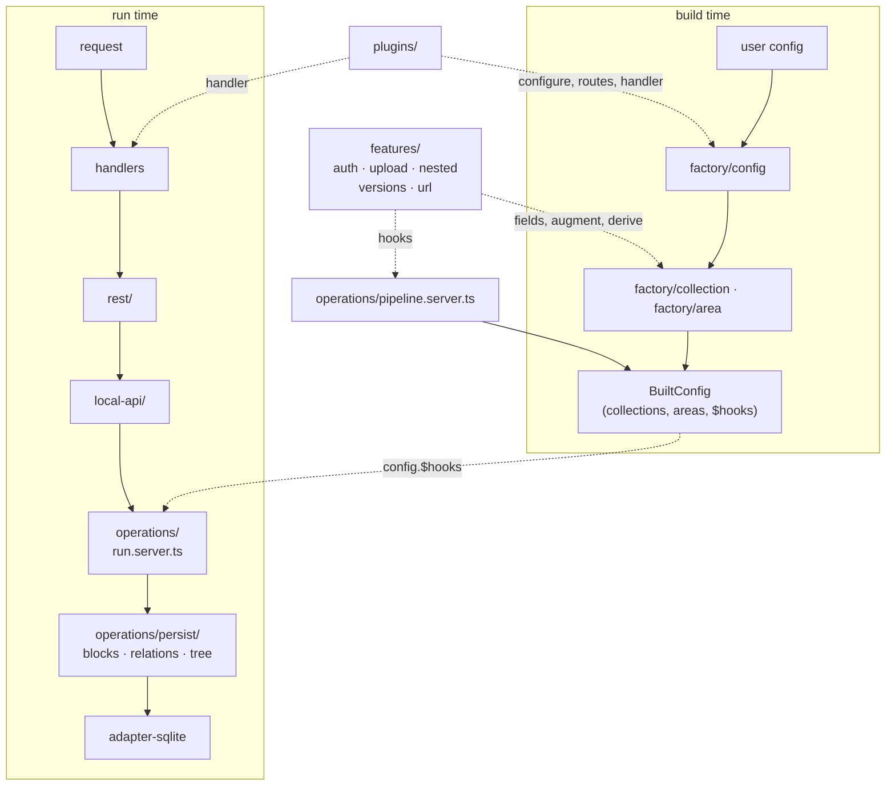

# `src/lib/core` — structure audit & target

> Status: **applied**, over two rounds. Sections 3 and 4 describe the layout as it was
> _before_ the change and are kept as the record of why it moved; section 0 describes where it
> landed, including the placement rule that came out of the second round.
>
> **§§12–14 are not applied.** §12 argues that two rounds produced a better categorization but
> still not a _pattern_, and proposes the missing one: a `Feature` contract, sibling to the
> `Plugin` and `FieldBuilder` contracts this repo already has. §13 pushes it — three phases
> (**codegen → boot → runtime**, three moments in one process, not three programs) and
> collection/area as the two _base_ features. §14 does the load-bearing work: where each of the
> three hook kinds attaches, and how a feature reaches the adapter — which turns out to
> constrain the whole design, and sorts the five features into pure features, adapter
> capabilities, and the two that are both.
>
> Read them before §0's placement rule; they are what that rule was reaching for. §14.7 has the
> order of work, §13.8 the cheap first step.

## 0. Outcome

`ls src/lib/core` before → after:

```
areas/  collections/  config/  operations/     constants.ts  constants.server.ts  logger.server.ts
dev/  errors/  fields/  handlers/  i18n/    →  errors/  i18n/  fields/  prototype/
logger/  plugins/  types/                      factory/  operations/  features/
                                               rime/  rest/  handlers/  plugins/  dev/
```

Two directories are gone (`collections/`, `areas/`), and every entry left is a concept with a
real name — no `shared/`, no `types/`, no `naming.ts` grab-bag.

### The placement rule

The recurring question behind most of this was _"what is core, what is util?"_ — and the honest
answer for a long time was "wherever it landed". The rule now is:

| bucket                  | test                                                                   | examples                                            |
| ----------------------- | ---------------------------------------------------------------------- | --------------------------------------------------- |
| `util/`                 | imports **nothing** from rime; pure functions over language primitives | `string`, `object`, `path`, `coerce`                |
| `core/<concept>/`       | rime vocabulary, or always-on infrastructure                           | `prototype`, `fields`, `errors`, `i18n`             |
| `core/features/<name>/` | **`pipeline.server.ts` branches on it**                                | `auth`, `upload`, `nested`, `versions`, `url`       |
| `core/<layer>/`         | a stage of the flow                                                    | `factory`, `operations`, `rime`, `rest`, `handlers` |

Read the signature: if every type in it is a language type, it is a util; if any type is a rime
type, it belongs to that type's concept. `toKebabCase(s: string)` → util.
`withVersionsSuffix(slug: CollectionSlug)` → versions. `isStaff(user: User)` → auth.

Two clarifications make it workable:

- **A barrel is not a home.** `util/index.ts` still publishes `access`, `validate` and `doc`
  because `rimecms/util` is public API for config authors; where that code _lives_ is a separate
  question, and it lives with its concept.
- **The feature test is mechanical, not a matter of taste.** It is what
  `pipeline.server.ts` branches on. That settles localization: nothing branches on it,
  `setDocumentLocale` runs unconditionally and every table gets the `Locales` treatment, so it
  is infrastructure and `withLocalesSuffix` sits in `core/i18n/` — not a feature folder.

Applying the rule paid for itself: splitting `util/doc.ts` (document builders → `prototype/`,
path helpers → `util/path.ts`, `ensurePathExists` → `util/object.ts`) removed a real circular
dependency. **Madge is at 6, down from 7.**

Two things came out simpler than round 1 planned:

- **`augment-title` needed no `titleFallback` parameter.** The area variant is the collection
  one minus branches that cannot fire on an area, so one file covers both.
- **`operations/` kept a `collection/` and `area/` split.** `runUpdate` removed the duplicated
  _pipeline_; what is left per file is genuinely per-prototype.

### Four inconsistencies, settled

Round 1 preserved these verbatim and flagged them; round 2 settled them. The first took two
attempts and is the interesting one.

1. **Create chains the hook config, like update.** The `chainConfig` flag is gone.

   The first attempt failed e2e (`tests/basic` "Should not create a user" expected 403, got 400)
   and was reverted with a comment arguing the flag was deliberate. That comment was wrong. The
   real cause was two fields away:

   - `confirmPassword` was declared with no `.access()`, so it kept `FormFieldBuilder`'s
     constructor default `create: (user) => !!user`. On an anonymous `POST /api/users` it was
     stripped by `validateFields`' access block.
   - `validateFields` then applied `required` to the value that block had just emptied,
     reporting `REQUIRED_FIELD` → 400, before `createBetterAuthUser` could reach its 403.

   Not chaining had merely been hiding that, at the cost of making `augmentFieldsPassword` dead
   code on create: it ran, built an amended config, and had it discarded, so **no create path
   ever enforced the password policy**. Both bugs are fixed below, and chaining now works.

   Ordering is load-bearing: `augmentFieldsPassword` must run _after_ `mergeWithBlankDocument`.
   The blank document is built from `config.fields` and the config map from the _data_, so
   augmenting first gives every create a blank `password` that fails its own `.required()` —
   including better-auth's post-signup callback, which legitimately creates the document with
   `{ name, email, authUserId }` and no password.

2. **`afterUpdate` returns what its hooks handed back**, matching `afterCreate`.
3. **`transform.doc` moved inside the per-document `try/catch`** in `find()`.
4. **The inference guard covers the core plugins**, not just slug literals.

### Two bugs found underneath #1

Both were pre-existing, and neither is auth-specific.

- **`confirmPassword` is no longer a document field.** It is a form control: comparing two
  values the same client just sent proves nothing server-side, and modelling it as data is what
  forced `restCreate` to fake it (`data.confirmPassword = data.password`) before every API
  create. `augmentFieldsPassword` now appends `password` only, the fake is deleted, and the
  panel keeps the match check where a typo can still be corrected (`AuthFooter.svelte`).

- **`required` no longer fires on a field the request may not write.** A field emptied by the
  access block cannot be supplied by the caller, so demanding it is an unsatisfiable 400. This
  reaches well past auth: with `access.create` defaulting to `(user) => !!user`, _any_
  publicly-creatable collection — a sign-up, a contact form — 400s on every `.required()` field
  that does not explicitly override it. No e2e fixture covers this (they all declare
  `create: () => true` on the fields they post), so it is guarded by
  `operations/steps/validate-fields.spec.ts`, verified to fail without the fix.

### Verification

`svelte-check` 0 errors, `vitest` 90/90, `madge` 6 cycles. `bun run test` (375 e2e tests across
six suites) passed at the end of round 1, and is what surfaced the config-chaining regression;
the changes above still want a full run.

Reproducing `bun run test` needs `.env` per CONTRIBUTING plus an SMTP server at
`RIME_SMTP_HOST` speaking implicit TLS with a trusted certificate: creating an API key really
does send mail.

## 1. Scope & method

Read in full: every directory under `src/lib/core`, plus the entry points
(`src/lib/{index,server,types}.ts`), `package.json`, `svelte.config.js`,
`vite.config.ts`, and the generated-type / generated-route machinery under
`core/dev`.

**Out of scope — these stay intact:**

|                                                           | why                                                               |
| --------------------------------------------------------- | ----------------------------------------------------------------- |
| `src/lib/adapter-sqlite/`                                 | Coherent already: one file per concern, one entry point.          |
| `src/lib/fields/`                                         | The vertical slice this proposal wants to generalise, not change. |
| `src/lib/panel/`                                          | Separate axis (UI), separate problem.                             |
| `src/lib/util/`, `src/lib/core/{dev,i18n,logger,errors}/` | Leaf infrastructure, no cross-cutting.                            |

`core/fields/builders/` also stays where it is. It holds `FieldBuilder`,
`FormFieldBuilder`, `BooleanFieldBuilder`, `PickOne/PickManyFieldBuilder` — the
base classes every field in `src/lib/fields/*` extends. This is the one place
where "builder" is the correct word, and it is imported from `fields/`,
`panel/`, `adapter-sqlite/` and `core/` alike.

## 2. The problem, in one sentence

`ls src/lib/core` tells you **what kind of thing** a file is. It never tells you
**where that thing sits in the request flow**.

---

## 3. The layout before

```
src/lib/core/                            LOC   files
├── collections/                        4090     65   ← prototype + layer + feature, all three
│   ├── config/                                  17     the factory (create()) + 14 augments
│   ├── operations/                               7     create, find, findById, updateById, delete…
│   ├── rest/                                     8     HTTP adapters over local-api
│   ├── auth/          hooks/ ×7 timing dirs     14     FEATURE
│   ├── upload/        hooks/ disk/ util/        16     FEATURE
│   ├── nested/        hooks/index.server.ts      1     FEATURE
│   ├── versions/      operations.ts              1     FEATURE
│   └── local-api.server.ts
├── dev/                                 4088     23   CLI, codegen, vite plugin — coherent
├── operations/                          2182     31
│   ├── hooks/         before-* ×5 timing dirs   17     generic pipeline steps + the Hook types
│   ├── blocks/ relations/ tree/                  9     relational persistence
│   ├── configMap/                                3
│   └── extract-data.server.ts                          ← parses a Request body
├── config/                              1898     27
│   ├── client/ server/ shared/                  22     the global buildConfig pipe
│   └── auth/          better-auth-*.ts           3     ← auth, part 2
├── fields/                              1109      7   builder base classes + util
├── areas/                                713     14   config/ operations/ rest/ — collections, again
├── plugins/                              640     16   definePlugin + cache, sse, mailer, api-init
├── handlers/                             468      6   the SvelteKit handle chain
├── i18n/ errors/ logger/ types/          810     15
├── rime.server.ts  constant.ts  constant.server.ts  naming.ts  ensure.server.ts
```

Three orthogonal axes are braided into that one tree:

- **prototype** — `collections/`, `areas/`
- **layer** — `config/` (factory), `local-api`, `rest/`, `operations/`
- **feature** — auth, upload, nested, versions, url

Every feature is smeared across the other two axes. That is the whole finding;
everything below is a consequence.

---

## 4. Findings

### 4.1 Hooks live in four places, in four different conventions

| where                                           | count | convention                                          |
| ----------------------------------------------- | ----- | --------------------------------------------------- |
| `core/operations/hooks/before-*/`               | 16    | grouped into 5 timing directories                   |
| `core/collections/auth/hooks/{before,after}-*/` | 9     | grouped into 7 timing directories, one level deeper |
| `core/collections/upload/hooks/*.server.ts`     | 7     | flat, no timing directories                         |
| `core/collections/nested/hooks/index.server.ts` | 1     | one hook, in a `hooks/` directory, named `index`    |

Same kind of object, four shelvings. Finding the hook you want means knowing in
advance which of the four schemes its author picked.

### 4.2 The one file where the flow _is_ legible is filed under "config"

`collections/config/augment-hooks.server.ts` is the real pipeline definition —
the only place in the codebase where you can read every hook and its order:

```ts
beforeRead: [
  ...(collection.auth ? [removePrivateFields] : []),
  processDocumentFields,
  setDocumentTitle,
  setDocumentLocale,
  setDocumentType,
  ...(collection.upload  ? [populateSizes]      : []),
  ...(collection.$url    ? [populateURL]        : []),
  ...(collection.nested  ? [addChildrenProperty]: []),
  setDocumentThumbnail,
  sortDocumentProps
],
```

Nothing in the path `collections/config/augment-hooks.server.ts` suggests this is
where the flow is written down. It also exists twice — `areas/config/augment-hooks.server.ts`
is the same file with the feature branches deleted — so the two pipelines can
drift without anyone noticing.

**This file's shape is an asset and the target must preserve it.** See §7.

### 4.3 `operations` names four different things

- `core/operations/` — the shared pipeline internals
- `core/collections/operations/` — collection entry points
- `core/areas/operations/` — area entry points
- `core/collections/versions/operations.ts` — version _strategy_ constants
  (`UPDATE_PUBLISHED`, `NEW_DRAFT_FROM_PUBLISHED`, …), a completely unrelated sense

And `core/operations/` is itself four unrelated concerns in one folder:

| path                              | actually is                                                                                                    |
| --------------------------------- | -------------------------------------------------------------------------------------------------------------- |
| `hooks/index.server.ts` (217 LOC) | the `Hook` / `HookContext` / `OperationContext` **type definitions** plus the `Hooks` factory — no hooks in it |
| `hooks/before-*/`                 | the generic pipeline **steps**                                                                                 |
| `blocks/ relations/ tree/`        | **relational persistence** (extract → diff → write), called by every write op                                  |
| `extract-data.server.ts`          | **HTTP body parsing** (`multipart/form-data`, JSON) — not an operation at all                                  |

### 4.4 `areas/` is `collections/` copy-paste

Byte-identical apart from the generic parameter:

- `augment-metas.ts` — differs only in `Area<any>` vs `Collection<any>`
- `augment-url.ts` — same
- `augment-versions.ts` — same, and both carry the same doc comment; the only
  textual difference is a typo (`drat` in the area copy, `draft` in the
  collection copy)

Structurally identical:

- `areas/operations/update.ts` vs `collections/operations/updateById.ts` — the
  same eight steps written twice:
  `beforeOperation hooks → beforeUpdate hooks → assert context → adapter write →
saveBlocks → saveTreeBlocks → saveRelations → re-read → afterUpdate hooks`
- `areas/rest/update.server.ts` vs `collections/rest/updateById.server.ts` — same
  guard / `extractData` / `setLocale` / `trycatch` / `json` shape
- `areas/local-api.server.ts` vs `collections/local-api.server.ts` — same facade

Genuinely different, and worth keeping different: `augment-title.ts` (a collection
falls back to `filename` for upload, `email`/`name` for auth; an area falls back
to `id`), and the fact that areas have no create/delete.

### 4.5 An unnamed concept: **derived collections**

Three places synthesize collections the user never wrote, each in a different
home, none of them naming the shared idea:

| what               | where                                         | derives                         |
| ------------------ | --------------------------------------------- | ------------------------------- |
| versions           | `config/shared/versions-alias.server.ts`      | `pages` → `pages_versions`      |
| upload directories | `config/server/augment-directories.server.ts` | `medias` → `medias_directories` |
| staff              | `config/shared/get-staff-collection.ts`       | the panel-users collection      |

`augment-directories.server.ts` even hand-wires a second, private hook pipeline
(`exctractPath`, `prepareDirectoryChildren`, `updateDirectoryChildren`) that
never appears in `augment-hooks.server.ts` — a second big picture, hidden in a
file named after config augmentation.

### 4.6 Auth has no single home

Auth is currently three separate things in three separate trees:

| tree                                              | what it is                                                                                                                            |
| ------------------------------------------------- | ------------------------------------------------------------------------------------------------------------------------------------- |
| `core/config/auth/` (3 files)                     | the **better-auth integration** — instance config, permissions, better-auth's own hooks. Transversal, built once in `rime.server.ts`. |
| `core/collections/auth/` (14 files)               | the **per-collection capability** — fields, private-field constants, 9 hooks, util, types.                                            |
| `config/{shared,client,server}/*staff*` (3 files) | the **staff collection derivation**.                                                                                                  |

This split is not arbitrary — the first really is a different kind of thing from
the second. But nothing in the layout says so, and "where does auth live?" has no
answer today. §6.3 gives it one.

### 4.7 Mixed file-naming conventions

`buildTreeMap.ts`, `deleteById.ts`, `findById.ts`, `updateById.ts` (camelCase)
sit beside `populate-url.server.ts`, `merge-with-blank.server.ts`,
`augment-hooks.server.ts`, `set-default-values.server.ts` (kebab-case). The split
is roughly "files named after a method" vs "files named after a step", but it is
not applied consistently and there is no stated rule.

### 4.8 Single-file folders wrapped in ceremony

`collections/nested/hooks/index.server.ts` (one hook), `collections/versions/operations.ts`
(one folder, one file), `collections/config/types.ts` (one 4-line type),
`core/types/index.ts` (7 lines).

---

## 5. What already works — generalise these, don't replace them

**`src/lib/fields/*`** — one folder per field: the builder, its `component/`, its
types, and optionally a `module.ts` / `module.server.ts` split. You can delete a
field by deleting a directory. This is the shape the rest of the codebase wants.

**`factory/`** (locally: `collections/config/` → `collections/factory/`, with
`builder.ts` → `index.ts`) — the right word. A _factory_ turns an authored
declaration into a `Built*` object. "Builder" stays reserved for
`core/fields/builders/`, which really is a builder API.

**`augment-hooks.server.ts`** — see §4.2. The one legible file. Preserve its shape.

**`$rime/modules`** (`core/dev/vite/index.server.ts`, `core/dev/generate/runtime/`) —
already scans **any** folder under `src/lib` for a `module.ts` / `module.server.ts`
pair and resolves the correct side per build target, stubbing the missing side's
export names so ESM link-time binding still works. Any future feature folder that
needs a client/server split needs **no new machinery**.

**`core/plugins/`** — `definePlugin` with `name` / `configure` / `actions` /
`routes` / `handler`. Public, and already carrying `cache`, `sse`, `mailer`,
`api-init`.

**`rest/` and `core/handlers/index.ts`** — thin, uniform, and already written as
ordered lists. Keep both, unchanged in shape.

---

## 6. Target structure

`ls src/lib/core` should read as the flow:

```
core/
  factory/      1. authored declaration → Built*     (build time)
    config/         the global pipe — inference-critical, see §9.1
    collection/     was collections/config/
    area/           was areas/config/
    shared/         augments both prototypes use
  operations/   2. request + data → document          (run time)
  features/     what plugs into 1 and 2
  local-api/    3a. programmatic entry — rime.collection('x').create()
  rest/         3b. HTTP entry
  handlers/     3c. SvelteKit handle chain
  plugins/      public plugin contract + built-ins
  dev/  errors/  i18n/  logger/  types/  fields/      (unchanged)
```



### 6.1 `core/operations/`

```
operations/
  types.ts             Operation, Timing, HookContext, Hook, OperationContext
  hooks.ts             the `Hooks` factory helper
  pipeline.server.ts   THE big picture — collectionPipeline + areaPipeline + directoriesPipeline
  run.server.ts        the shared steps, written once, prototype-parameterized
  collection/          create, find, find-by-id, update-by-id, delete, delete-by-id, duplicate
  area/                find, update
  steps/               the remaining generic steps, flat — pipeline.server.ts is the index
  persist/             blocks/  relations/  tree/
  config-map/
```

`extract-data.server.ts` moves to `rest/` — it parses a `Request` body (§4.3).

`steps/` holds what is left of today's 16 generic hooks once the 3 version hooks
and `populate-url` move to their features (§8) — the steps that really are
prototype- and feature-agnostic.

`steps/` is flat on purpose. The timing directories (`before-read/`,
`before-upsert/`, …) duplicate information that `pipeline.server.ts` already
states more precisely, and they mislead: `before-upsert/` holds steps that run in
both create and update, which is not a timing.

### 6.2 `core/features/<name>/` — a convention, not a registry

Each feature folder exports a conventional named set:

```ts
// features/<name>/index.server.ts
export const fields         = (config) => FieldBuilder[]   // was augment-*.ts pushing fields
export const augment        = (config) => config           // client-safe
export const augmentServer  = (config) => config           // server-only
export const derive         = (config) => BuiltCollection[] // §4.5
export * as hooks from './hooks/index.server.js'
```

The factory and the pipeline **import those by name and compose them
explicitly**. Nothing iterates a feature array. This is deliberate — see §9.1
and §9.2 — the contract exists so that every feature _looks_ the same, not so
that the wiring can be automated away.

`nested` and `upload` are two separate features that happen to compose; there is
no combined "nested upload" feature.

| feature    | absorbs                                                                                                                                                                                                        |
| ---------- | -------------------------------------------------------------------------------------------------------------------------------------------------------------------------------------------------------------- |
| `upload`   | `collections/upload/**`, `collections/config/augment-upload{,.server}.ts`, `config/shared/upload-directories.ts`, `config/{client,server}/augment-directories*.ts`                                             |
| `nested`   | `collections/nested/hooks/index.server.ts`, `collections/config/augment-nested{,.server}.ts`                                                                                                                   |
| `versions` | `collections/versions/operations.ts`, `{collections,areas}/config/augment-versions.ts`, `config/shared/versions-alias.server.ts`, and the 3 version hooks now under `operations/hooks/before-{update,upsert}/` |
| `url`      | `{collections,areas}/config/augment-url.ts`, `operations/hooks/before-read/populate-url.server.ts`                                                                                                             |
| `auth`     | below                                                                                                                                                                                                          |

### 6.3 Where auth lives

One folder, three named parts — the distinction from §4.6 kept visible rather
than dissolved:

```
features/auth/
  provider/        better-auth itself — instance config, permissions,
                   better-auth's own hooks.  (was core/config/auth/*)
                   Transversal: built once in rime.server.ts, not per collection.
  staff/           the staff collection derivation
                   (was config/shared/get-staff-collection.ts
                    + config/{client,server}/augment-staff*.ts)
  index.server.ts  fields.ts  constant.server.ts  util.ts  types.ts
  hooks/*.server.ts
                   the per-collection auth capability
                   (was collections/auth/**, timing dirs flattened)
```

"Where does auth live?" → `features/auth/`. "Which auth?" → the subfolder name
answers it.

### 6.4 `core/factory/`

`collections/config/` + `areas/config/` + `config/{client,server,shared}/` merge
into `core/factory/`:

- `factory/config/` — the global pipe (`buildConfig`, `buildConfigClient`,
  `validate`, `write`, `context`). **Inference-critical, see §9.1.**
- `factory/collection/`, `factory/area/` — `index.ts` / `index.server.ts`
  exporting `create()`.
- `factory/shared/` — the prototype-agnostic augments that belong to no feature:
  `augment-metas`, `augment-title`, `augment-icons`, `augment-prototypes`,
  `find-title`, `find-thumbnail`.

Each of the three byte-identical pairs from §4.4 collapses to a single copy, but
in two different places: `augment-metas` in `factory/shared/`, `augment-url` in
`features/url/`, `augment-versions` in `features/versions/` — a duplicated augment
that belongs to a feature goes to the feature, not to `shared/`.

`augment-title` needed no `titleFallback` parameter in the end: the area variant was the
collection one minus the `upload` and `auth` branches, and an area has neither, so the
collection implementation applied to an area already falls through to `id`. One shared file,
same behaviour.

---

## 7. The hooks big picture is a requirement

`pipeline.server.ts` keeps `augment-hooks.server.ts`'s exact readable shape — a
literal ordered array per timing, with inline conditional branches:

```ts
export const collectionPipeline = (c: BuiltCollection) => ({
  beforeRead: [
    ...(c.auth ? [auth.hooks.removePrivateFields] : []),
    steps.processDocumentFields,
    steps.setDocumentTitle,
    ...(c.upload ? [upload.hooks.populateSizes] : []),
    ...(c.$url ? [url.hooks.populateURL] : []),
    ...(c.nested ? [nested.hooks.addChildren] : []),
    steps.setDocumentThumbnail,
    steps.sortDocumentProps
  ]
  // …
});

export const areaPipeline = (a: BuiltArea) => ({/* … */});
```

Two things change, and only two: the imports resolve to `features/*` and
`operations/steps/` instead of four scattered trees, and the collection and area
pipelines sit side by side in one file so their differences are visible.

**What must not happen:**

```ts
// ✗ never — this deletes the only legible description of the flow
for (const feature of FEATURES) {
  if (feature.appliesTo(config)) mergeHooks(pipeline, feature.hooks);
}
```

Ordering is the interesting part of a pipeline. It stays hand-written.

The private directories pipeline from §4.5 moves into this file too, as a third
named export, so there is exactly one place to read.

---

## 8. Move table

What was moved, and where to. Kept as the record of the migration.

| from                                                                                | to                                                                                                                             |
| ----------------------------------------------------------------------------------- | ------------------------------------------------------------------------------------------------------------------------------ |
| `collections/config/builder.ts` · `builder.server.ts`                               | `factory/collection/index.ts` · `index.server.ts`                                                                              |
| `collections/config/augment-{label,panel,thumbnail}.ts`                             | `factory/collection/`                                                                                                          |
| `collections/config/augment-{metas,title}.ts`                                       | `factory/shared/` (merged with the area copies)                                                                                |
| `collections/config/augment-url.ts` · `augment-versions.ts`                         | `features/url/` · `features/versions/` (merged with the area copies)                                                           |
| `collections/config/augment-hooks.server.ts`                                        | `operations/pipeline.server.ts`                                                                                                |
| `collections/config/augment-auth{,.server}.ts`                                      | `features/auth/`                                                                                                               |
| `collections/config/augment-upload{,.server}.ts`                                    | `features/upload/`                                                                                                             |
| `collections/config/augment-nested{,.server}.ts`                                    | `features/nested/`                                                                                                             |
| `collections/config/types.ts`                                                       | `factory/collection/index.ts` (4-line type, inline it)                                                                         |
| `collections/operations/*.ts`                                                       | `operations/*.ts` (merged with the area copies)                                                                                |
| `collections/rest/*.server.ts`                                                      | `rest/collection/`                                                                                                             |
| `collections/local-api.server.ts`                                                   | `local-api/collection.server.ts`                                                                                               |
| `collections/auth/**`                                                               | `features/auth/` (timing dirs flattened)                                                                                       |
| `collections/upload/**`                                                             | `features/upload/` (`disk/` kept, `util/` flattened, `upload.d.ts` → `types.ts`)                                               |
| `collections/nested/hooks/index.server.ts`                                          | `features/nested/hooks/add-children.server.ts`                                                                                 |
| `collections/versions/operations.ts`                                                | `features/versions/strategy.ts`                                                                                                |
| `areas/config/builder{,.server}.ts` · `types.ts`                                    | `factory/area/`                                                                                                                |
| `areas/config/augment-{metas,title}.ts`                                             | `factory/shared/` (dropped — identical to the collection copies)                                                               |
| `areas/config/augment-{url,versions}.ts`                                            | `features/{url,versions}/` (dropped — identical to the collection copies)                                                      |
| `areas/config/augment-hooks.server.ts`                                              | `operations/pipeline.server.ts`                                                                                                |
| `areas/operations/*.ts`                                                             | `operations/*.ts` (merged with the collection copies)                                                                          |
| `areas/rest/*.server.ts`                                                            | `rest/area/`                                                                                                                   |
| `areas/local-api.server.ts`                                                         | `local-api/area.server.ts`                                                                                                     |
| `config/{client,server}/build-config*.ts`                                           | `factory/config/`                                                                                                              |
| `config/{client,server}/augment-directories*.ts`                                    | `features/upload/`                                                                                                             |
| `config/{client,server}/augment-staff*.ts`                                          | `features/auth/staff/`                                                                                                         |
| `config/{client,server}/augment-{panel,panel-access,cors,plugins}*.ts`              | `factory/config/`                                                                                                              |
| `config/shared/augment-{icons,prototypes}.ts` · `find-{title,thumbnail}.ts`         | `factory/shared/`                                                                                                              |
| `config/shared/upload-directories.ts`                                               | `features/upload/derive.ts`                                                                                                    |
| `config/shared/versions-alias.server.ts`                                            | `features/versions/derive.server.ts`                                                                                           |
| `config/shared/get-staff-collection.ts`                                             | `features/auth/staff/derive.ts`                                                                                                |
| `config/auth/better-auth*.ts`                                                       | `features/auth/provider/`                                                                                                      |
| `config/client/index.ts` · `config/server/index.server.ts`                          | `factory/config/` — **published entry points, see §9.3**                                                                       |
| `config/config-context.server.ts` · `config/server/{validate,write}.server.ts`      | `factory/config/`                                                                                                              |
| `config/types.ts`                                                                   | `factory/config/types.ts`                                                                                                      |
| `operations/hooks/index.server.ts`                                                  | split → `operations/types.ts` + `operations/hooks.ts`                                                                          |
| `operations/hooks/before-*/*.server.ts`                                             | `operations/steps/` (flat), except the 3 version hooks → `features/versions/hooks/` and `populate-url` → `features/url/hooks/` |
| `operations/{blocks,relations,tree}/`                                               | `operations/persist/{blocks,relations,tree}/`                                                                                  |
| `operations/configMap/`                                                             | `operations/config-map/`                                                                                                       |
| `operations/shared/fallback-data-from-original.ts`                                  | `operations/steps/`                                                                                                            |
| `operations/extract-data.server.ts`                                                 | `rest/extract-data.server.ts`                                                                                                  |
| `handlers/`, `plugins/`, `dev/`, `errors/`, `i18n/`, `logger/`, `types/`, `fields/` | unchanged                                                                                                                      |
| `rime.server.ts`, `constant{,.server}.ts`, `naming.ts`, `ensure.server.ts`          | unchanged (core root)                                                                                                          |

Checked exhaustive: all 65 files under `collections/`, 14 under `areas/`, 27 under
`config/` and 31 under `operations/` are matched by a row above, and every
directory in `find src/lib/core -type d` is accounted for.

---

## 9. Invariants a migration must not break

### 9.1 Type inference from user config → `event.locals.rime`

This is the single most fragile thing in the refactor. The chain, verified:

```
user config C
  → augmentConfig<C>()                         config/server/build-config.server.ts
      a literal sequence of `const withX = augmentX(prev)`
  → BuildConfig<C> = ReturnType<typeof augmentConfig<C>> & {
        $InferCollections, $InferAreas, $InferCollectionsSlug, $InferAreasSlug,
        $InferPluginsServer, $InferAuthPlugins, $InferRoutes }
  → createRime<C>(config)                      rime.server.ts
  → Rime<C> = Awaited<ReturnType<typeof createRime<C>>>
  → .rime/rime.config.server.ts  (default export)
  → app.generated.d.ts:
        rime: ReturnType<Awaited<
          typeof import('…/rime.config.server')>['createRimeContext']>
```

`ReturnType<typeof augmentConfig<C>>` is what carries collection and area slug
literals all the way to `event.locals.rime.collection('…')`. Therefore:

```ts
// ✓ keep — each step's return type narrows the next
const withStaff = augmentStaffServer(config);
const withIcons = augmentIcons(withStaff);
const withPanel = augmentPanel(withIcons);

// ✗ never — collapses to the widest type, slug unions become `string`
const output = AUGMENTS.reduce((c, augment) => augment(c), config);
```

**How to check after each phase:** in `tests/consumer`, hover
`event.locals.rime.collection('` and confirm the completion list is still the
literal slug union, not `string`. `bun run check` will not catch this on its own.

### 9.2 The hooks big picture

One file, literal order, no iteration. See §7.

### 9.3 Published paths

`package.json` `exports` pins:

- `dist/core/config/client/index.js` → `rimecms/config`
- `dist/core/config/server/index.server.js` → `rimecms/config/server`
- `dist/core/dev/vite/index.server.js` → `rimecms/vite`

`package.json` `bin` pins `dist/core/dev/cli/index.js`. `svelte.config.js`
repeats the first two as aliases.

Consumers import `rimecms/config`, never the dist path, so the dist paths are
free to change — **provided `package.json` and `svelte.config.js` move together**.
`bun run package` runs `publint` and will catch a mismatch.

### 9.4 `$rime/modules`

The Vite plugin keys splits by folder path relative to `src/lib`, and
`generate-manifest` **hard-errors if two different splits export the same name**.
Only `fields/{link,relation}` and `core/plugins/{cache,sse,mailer,api-init}` have
pairs today, and none of them move — but any new `module.server.ts` added under
`features/` inherits that global-uniqueness constraint. Published subpaths
(`$rime/modules/rimecms/<folder>`) are derived from the folder path, so renaming
a folder that has a pair is a breaking change for consumers.

### 9.5 Type re-exports

`src/lib/types.ts` re-exports deep core paths
(`core/collections/auth/types.js`, `core/collections/upload/upload.js`,
`core/handlers/routes.server.ts`, `core/config/types.js`, …). Type-only, so safe
to repoint — but it must be repointed, and it is easy to miss because nothing
imports it inside the repo.

### 9.6 Volume

~643 `$lib/core/...` deep imports in `src/`. Mechanical, but large enough that
each phase wants its own commit.

---

## 10. Phased migration

Each phase was shipped and verified independently — one commit each, in this order.

| #   | phase                         | changes                                                                                                                                                                                                                                                                 | risk   |
| --- | ----------------------------- | ----------------------------------------------------------------------------------------------------------------------------------------------------------------------------------------------------------------------------------------------------------------------- | ------ |
| 1   | **`features/` extraction**    | Pure moves + import rewrites. Co-location only — no new contract, `augment-hooks.server.ts` keeps its current wiring, just with new import paths. Kills the §4.1 scattering and answers §4.6.                                                                           | low    |
| 2   | **One `pipeline.server.ts`**  | Merge the two `augment-hooks.server.ts` into one file with `collectionPipeline` + `areaPipeline` + the directories pipeline from §4.5. Adopt the `features/*` named-export convention (§6.2).                                                                           | low    |
| 3   | **`operations/` unification** | Extract `run.server.ts` from the duplicated 8-step pipelines (§4.4); flatten `hooks/before-*/` → `steps/`; `blocks` / `relations` / `tree` → `persist/`; split `hooks/index.server.ts` into `types.ts` + `hooks.ts`. **The only phase that changes runtime behaviour.** | high   |
| 4   | **`factory/` merge**          | `collections/config` + `areas/config` + `config/` → `core/factory/`. Dedupe `augment-metas` and `augment-title` into `factory/shared/`. Touches §9.1 — do it in its own commit and run the inference spot-check.                                                        | medium |
| 5   | **Naming pass**               | kebab-case throughout; `extract-data` → `rest/`; barrels; inline the single-file-folder ceremony from §4.8.                                                                                                                                                             | low    |

Phase 3 was where the real win and the real risk were, and it split into 3a
(mechanical moves) and 3b (`run.server.ts`). Phases 1, 2, 4 and 5 were `git mv`
plus import rewrites, done with a codemod that resolves each specifier against
the old tree and re-emits it from the importer's new location.

### Verification for each phase

```bash
bun run check              # svelte-check — catches every broken import
bun run check:circular-deps # madge — the structural guard; must not regress
bunx vitest run            # src/**/*.spec.ts
bun run test               # the 6 Playwright suites — the real safety net
bun run package            # publint: proves the exports map still resolves (§9.3)
```

`bun run test` needs a `.env` (see CONTRIBUTING) and, for the `basic` and
`fields` suites, an SMTP server at `RIME_SMTP_HOST` speaking implicit TLS with a
trusted certificate — creating an API key genuinely sends mail.

Plus, for phases 3 and 4, the inference spot-check from §9.1 — no automated check
covers it.

---

## 11. Open questions

- **`core/fields/`** — `builders/` genuinely belongs to fields, not to core.
  Moving it to `src/lib/fields/builders/` would be natural (`src/lib/fields/index.ts`
  already re-exports all four classes) but `src/lib/fields/` is out of scope here.
  Deferred. **§12.2 answers this the other way**: `builders/` is the field _contract_,
  and a contract lives in `core/` while its implementations live in `lib/`. So
  `core/fields/builders/` is already correct, and it is `core/fields/` that needs
  labelling as a contract rather than moving.
- **`local-api/` vs `operations/`** — the facades are thin (`CollectionAPI` mostly
  resolves the locale and consults the cache). They could fold into `operations/`
  and drop a layer. Kept separate above because the cache-key logic is a real
  concern and `rime.collection(…)` is public API. **§12.6 settles this**: being
  public API is what makes it the runtime layer's entry point, not what keeps it in
  a separate directory. It folds into `operations/`.
- **`rest/collection/` + `rest/area/` vs a flat `rest/`** — after §4.4's
  deduplication the handlers may be similar enough to merge. Decide during
  phase 3, not before.

---

## 12. Round 3 — the missing contract (proposed, not applied)

Rounds 1 and 2 produced a better _categorization_. They did not produce a _pattern_. The
difference matters for exactly one reader: someone who knows nothing about the project and
wants to add a feature. Today the honest answer to "where do I start?" is "read about seventy
files", and no amount of folder renaming fixes that.

### 12.1 The observation

This repo already contains the pattern it is missing — twice.

| contract                                                      | implementations                                   | cost of adding one |
| ------------------------------------------------------------- | ------------------------------------------------- | ------------------ |
| `core/fields/builders/*` — `FieldBuilder`, `FormFieldBuilder` | `lib/fields/<name>/` × 21                         | obvious            |
| `core/plugins/index.ts` — `Plugin`, `definePlugin`            | `plugins/{cache,sse,mailer,api-init}`             | obvious            |
| _nothing_                                                     | `core/features/{auth,upload,versions,nested,url}` | archaeology        |

`Plugin` is four named seams in one object (`configure`, `actions`, `routes`, `handler`) plus a
`definePlugin` helper. A feature is a folder convention, learned by reading the code that
consumes it. §5 already said "generalise what works" and listed both of these — round 2 read
that as _keep them_ rather than _generalise them_. This section is the generalisation.

### 12.2 The pattern, stated

> **`core/<x>/`** is a contract and the machinery that runs it.
> **`lib/<x>/`** is implementations of a contract — yours, or a future external package's.
> **`util/`** has no contract and no rime types.

This supersedes §0's placement rule rather than contradicting it: the rule said where a _file_
goes, which is still true and still useful. This says why the folder exists at all, which is
what a contributor actually needs. It also disposes of the `core` vs `util` question for good —
`util/` is the bucket with no contract, which is why nothing there should ever be interesting.

Three contracts, by what they extend:

| contract       | extends         | declared in                                | seams                                            |
| -------------- | --------------- | ------------------------------------------ | ------------------------------------------------ |
| `FieldBuilder` | a **document**  | a collection's `fields: []`                | build, validate, hooks, component, generateType  |
| `Feature`      | a **prototype** | a key on a collection/area (`upload: {…}`) | enabled, augment, derive, schema, hooks, handler |
| `Plugin`       | the **app**     | `rime.config`'s `plugins: []`              | configure, routes, actions, handler              |

Feature and Plugin are siblings, not rivals: same vocabulary, different scope. That they
converge is the point — it is one idea applied at two altitudes.

### 12.3 Evidence: what no contract costs

Not hypothetical. `factory/collection/index.ts` and `index.server.ts` both compose the
augments, and they do it in **different orders**:

```
client:  label → upload → nested → versions → url → auth → metas → title → panel → thumbnail
server:  label → upload → nested → versions → url → panel → auth → metas → hooks → title → thumbnail
```

`hooks` being server-only is correct. `panel` moving from after `title` to before `auth` is
not explained anywhere. It is inert _today_ — `augmentPanel` reads only `panel` and `upload`,
both settled before either position — but nothing records that, and nothing would catch it
changing. Two hand-maintained sequences that must agree, with no shared declaration between
them, is the failure mode a contract exists to remove.

Second cost, in the same pair of files: the client `create` returns an explicit object literal
naming every key, the server one spreads `...augmented`. The whitelist is defensible — the
client object _is_ the sanitized surface — but it means a feature that adds a config key must
be remembered in a second, unlinked list, with no compiler help.

### 12.4 The `Feature` contract

Read off what the five existing features already do, not invented:

```ts
export type Feature = {
  name: string;
  /** The pipeline's `...(collection.upload ? [...] : [])` test, named once. */
  enabled: (config: BuiltCollection | BuiltArea) => boolean;
  /** buildtime — shape the authored config. Two sides, one declaration. */
  augment?: { client?: Augment; server?: Augment };
  /** buildtime — derive extra prototypes: staff, <slug>_directories, _versions. */
  derive?: (config: BuiltCollection | BuiltArea) => Prototype[];
  /** buildtime — extra columns, tables, table-name suffixes for the adapter. */
  schema?: SchemaContribution;
  /** runtime — named hooks. Named, deliberately not ordered; see 12.5. */
  hooks?: Record<string, Hook>;
  /** request — auth needs one. Same field, same meaning as Plugin's. */
  handler?: Handle;
};
```

Checked against all five before writing it down: `auth`, `upload` and `versions` fill every
slot; `nested` and `url` fill three. Nothing needs a slot that is not there, and no slot exists
for only one feature.

The win is not the type. It is that `enabled`, `augment`, `derive` and `hooks` stop being
things you discover by grepping for `features/upload` across the tree, and become things the
compiler enumerates.

### 12.5 Domain owns the code, layer owns the order

The tempting next step — `features/upload/{factory,operations,infra}` — is wrong. It produces
five parallel miniature trees and destroys the one file everybody agrees is good:
`pipeline.server.ts`, where the entire hook order is visible at once (§7 makes this a hard
requirement).

So the split is:

- the **domain** owns the code — every line of a feature stays in `features/<name>/`;
- the **layer** owns the order — `pipeline.server.ts` still spells out the sequence literally,
  by hand, and `factory/` still composes the augments in a written-out sequence.

The contract is what lets both be true without duplication. A feature _declares_
`hooks: { populateSizes, cleanUpFiles }`; the pipeline _places_ them. `enabled` replaces the
hand-written `collection.upload ?` test at each site, so the on/off condition is written once
instead of eleven times, while the ordering stays exactly as legible as it is now.

This is already how `Plugin` behaves: a plugin declares `handler`, and the handle chain decides
where it runs. Never a loop over a registry — §7 and §9.2 stand.

### 12.6 Structural corrections that follow

Round 2 got these wrong, and the contract view is what makes them obvious:

- **`core/prototype/` should not exist.** It was created to house `core/types/doc.ts` plus two
  utilities, and it shows: a folder holding a type alias and no behaviour. `collection | area`
  is the axis features branch on — a type parameter, not a directory. `createBlankDocument`
  builds a document from a config, which is `factory/`'s job by the §5 definition.
- **`local-api-*.server.ts` belongs with `operations/`.** It is a facade over
  `operations/collection/*` and it is the runtime layer's public entry (`rime.collection(…)`).
  `rime/` should keep only context assembly. §11 already flagged this as an open question and
  answered it too cautiously.
- **`pipeline.server.ts` is two files in one coat.** `collectionPipeline` / `areaPipeline` are
  the ordered table — runtime knowledge. `augmentCollectionHooks` / `augmentAreaHooks` apply it
  at build time and belong beside the other augments in `factory/`. The table is what §7
  protects; the augment is not.
- **`errors` / `i18n` are infrastructure and should be labelled as such**, not left as peers of
  `operations/` and `factory/`. `fields` is _not_ infrastructure — it is contract #1, and
  reads as a satellite only because nothing says so.

### 12.7 The argument-forwarding problem is the same problem

`runUpdate`, `runDataHooks` and `runDocHooks` removed real duplication — two ~80-line twins
that had to stay in lockstep — but every call site now reads as forwarding:

```ts
const after = await runDocHooks<CollectionSlug, T>({
  hooks: config.$hooks?.afterCreate,
  doc: document,
  data,
  config,
  event,
  operation: 'create',
  context
});
document = after.doc;
```

The cause is not the extraction. It is that `{ config, event, operation, context }` travel
together through every step of every operation and are re-spelled by hand at each seam, because
**no object owns them**. `operations/collection/find.ts` is mostly forwarding for the same
reason.

Give that tuple a name and the call becomes `runDocHooks(run, config.$hooks?.afterCreate, doc,
data)`. Same deduplication, no ceremony. Missing contract → argument bags → wrappers that look
like overhead: one cause, two symptoms. Do not undo the extraction; finish it.

### 12.8 What this reaches, and what it does not

Honest scope, because the cheap part and the expensive part are very different:

**Cheap** — `enabled`, `augment`, `derive`, `hooks`. These are consumed by `factory/` and
`operations/`, both of which already import features by name. Turning that into a declaration
is mostly mechanical.

**Expensive** — `schema` and generated types. `adapter-sqlite/generate-schema/` and
`dev/codegen/types/` would have to _read_ a registry instead of importing
`features/versions/naming.js` directly. That is a real refactor of two packages, and it is
where the design would actually be tested.

**Out of reach** — the panel. Roughly twenty components under `panel/` branch on `upload`,
`auth` and `nested`. Svelte components cannot be declared through this contract, and pretending
otherwise would produce a second registry that lies. A feature will remain partly manual there,
and the contract should say so rather than imply completeness.

### 12.9 Proposed proof, before committing

Convert two features and leave the other three alone:

- **`url`** — the smallest: one augment, one hook.
- **`upload`** — the largest: two augments, a derive, schema contributions, disk I/O, six hooks.

Two features under the new contract, three under the old convention, everything still green.
Then judge whether a `Feature` object reads the way `definePlugin` does. If it does not earn
its keep across those two, it will not earn it across five — and that is a cheap thing to find
out.

---

## 13. Round 3, pushed: three phases, and a prototype that is a feature

§12 named the missing contract. It still described features as feeding two things, "buildtime"
and "runtime", which is wrong in a way that hides the most useful structure in the codebase.
There are **three** phases, and a feature is consumed by all three.

### 13.1 The three phases

| phase       | when                                     | runs                                                                 | output                                                                                               |
| ----------- | ---------------------------------------- | -------------------------------------------------------------------- | ---------------------------------------------------------------------------------------------------- |
| **codegen** | dev, on config change or `rime generate` | `dev/codegen/*`, `generateSchema`, `generateRoutes`, `generateTypes` | **files on disk** — `.rime/`, `(rime)/` routes, `src/params/*`, drizzle schema, `app.generated.d.ts` |
| **boot**    | once per process, at server start        | `createRime()` — config context, adapter, better-auth, i18n          | **an in-memory object** — `event.locals.rime`                                                        |
| **runtime** | once per request                         | handle chain → route → operations → adapter                          | **a response**                                                                                       |

"Buildtime" collapsed the first two, and they are not alike: codegen _writes source files a
human can read and commit_, boot _constructs objects that vanish when the process dies_.

### 13.2 Codegen runs inside boot — by design

`core/rime/index.server.ts:45` opens an `if (dev)` block inside `createRime()` that calls
`generateRoutes`, `generateSchema`, `generateTypes` and `regenerateHooks`.

**This is correct and must stay.** In dev, codegen is on the fly: edit a collection, the module
graph invalidates, the config module re-evaluates, `createRime()` runs again, and the routes,
schema and types are rewritten as part of that reload. Codegen is not a separate program to be
extracted — it is **the codegen phase of a boot**, and boot is what triggers it. An earlier
draft of this section read the `if (dev)` block as a defect and proposed splitting it out; that
was wrong, and the split would break the dev loop.

Two consequences follow, and they are properties of the design rather than faults in it:

- **`rime generate` does codegen by booting.** `dev/cli/commands/generate.server.ts:84` spins a
  middleware-mode Vite server, `ssrLoadModule`s the generated config and awaits its default
  export — the `createRime()` promise. It does not statically analyse the config; it boots the
  app and lets boot's own codegen phase do the work. That is why `rime generate` fails on a
  project that was never `init`ed.
- **Two processes can therefore be in codegen at once** — a running dev server and a CLI
  invocation — which is why boot carries `process.env.RIME_CLI`, a `.cli` marker in the dev
  cache, and a "Skipping generation, `rime generate` is already running" path. That is
  concurrency control for a shared output directory, inherent to codegen-on-reload.

So the three phases are not three programs. They are **three moments in one process**, and each
runs in order on every dev reload: codegen (dev only) → boot → runtime. What the structure
lacks is not separate entry points; it is a declared place for a feature to attach to each
moment.

### 13.3 A feature is consumed at all three phases, through unmarked doors

Trace the five features against the three phases and the pattern is immediate:

| feature      | codegen                                    | boot                                                | runtime                            |
| ------------ | ------------------------------------------ | --------------------------------------------------- | ---------------------------------- |
| **auth**     | better-auth tables in the drizzle schema   | `betterAuth({…})` — `rime/index.server.ts:84`       | 9 hooks, `handlers/auth.server.ts` |
| **upload**   | `<slug>_directories` tables, sizes columns | `ensureMedias()` — **inside `createConfigContext`** | 6 hooks, disk I/O                  |
| **versions** | `<slug>_versions` tables, suffix naming    | —                                                   | 2 hooks                            |
| **nested**   | parent/children columns                    | —                                                   | 1 hook                             |
| **url**      | —                                          | —                                                   | 1 hook                             |

Two of those are the problem. `ensureMedias` sits at `factory/config/context.server.ts:18` —
the upload feature reaching into boot through the _config context factory_, which has no
business creating directories on disk. And better-auth is constructed inline in the middle of
`createRime`. Neither is declared anywhere; you find them by reading the boot function line by
line.

Meanwhile `adapter-sqlite/generate-schema/` imports `features/versions/naming.js` and
`features/upload/naming.js` directly. That is the codegen seam, wired by import rather than by
contract.

### 13.4 The payoff: a `boot.server.ts`

Everyone agrees `pipeline.server.ts` is the best file in the repo (§4.2, §7): one place where
the whole ordered sequence of a request's hooks is written out literally.

**Boot has no such file.** Its order — config context → media dirs → codegen → adapter →
better-auth → i18n — is implicit in the body of `createRime`, with one step hidden inside a
callee. It is exactly as order-dependent as the hook pipeline (the adapter must exist before
better-auth; the schema must be generated before the adapter reads it) and exactly as
invisible.

The single most valuable thing this direction produces is therefore not the `Feature` type. It
is:

```
core/boot.server.ts      ← what pipeline.server.ts is to a request
core/codegen.server.ts   ← what pipeline.server.ts is to a build
```

Ordered, literal, hand-written lists of contributions, one per phase, with the features'
entries visible in them. `createRime` shrinks to "run the boot list, return the context
factory". `ensureMedias` stops being a side effect of building a config object and becomes a
line in the boot list that says `upload`.

Same rule as §12.5 and §7: the phase list is hand-written and never a loop over a registry.
Ordering is the interesting part.

### 13.5 Collection and area are features

The sharpest version of the idea, and the code already agrees.

`dev/codegen/routes/index.server.ts:48` reads:

```ts
const hasCollections = (config.collections || []).length > 0;
const hasAreas = (config.areas || []).length > 0;
if (!hasCollections && pattern.includes('[slug=collection]')) continue;
if (!hasAreas && pattern.includes('[slug=area]')) continue;
```

That is an `enabled` test driving a `codegen.routes` contribution — the feature contract,
written by hand, for collection and area. Codegen already treats them as two optional,
independently-enabled contributors that emit routes and param matchers.

They contribute at every seam a feature does, and differ at every one:

| seam           | collection                                                        | area                       |
| -------------- | ----------------------------------------------------------------- | -------------------------- |
| factory        | `factory/collection/`                                             | `factory/area/`            |
| runtime ops    | find, findById, create, updateById, deleteById, delete, duplicate | find, update               |
| rest           | `rest/collection/` — 8 files                                      | `rest/area/` — 3 files     |
| local API      | `CollectionAPI`                                                   | `AreaAPI`                  |
| pipeline       | `collectionPipeline` — 7 timings                                  | `areaPipeline` — 4 timings |
| adapter        | `adapter-sqlite/collection.server.ts`                             | `…/area.server.ts`         |
| codegen routes | `[slug=collection]` + matcher                                     | `[slug=area]` + matcher    |
| panel          | list view, grid, folders                                          | single document            |

Every difference between a collection and an area is a difference in _what it contributes_.
That is the definition of a feature.

What follows:

- **`core/prototype/` finally dies properly.** §12.6 said it should not exist; this says what
  replaces it. `features/collection/` and `features/area/` — two base features — and the
  `collection | area` union becomes what it always was, the discriminant saying which base
  feature built this config.
- **Other features declare which base they compose onto.** `upload`, `auth` and `nested` are
  collection-only; `url` and `versions` apply to both. Today that is enforced by types and by
  `areaPipeline` simply not mentioning them — real knowledge, written nowhere.
- **`operations/{collection,area}/` and `rest/{collection,area}/` stop being a duplication
  smell** (§4.4) and become what they are: two base features' runtime contributions. The
  question "should these be merged?" dissolves — they are different features.

One refinement the contract needs: a base feature is **exclusive and mandatory** (exactly one
per config object, chosen by which factory you called), where a composed feature is **optional
and plural**. Same seams, different arity.

### 13.6 The unified model

Four kinds of contribution, one vocabulary, differing only in scope and arity:

| kind          | extends         | arity | selected by                                         |
| ------------- | --------------- | ----- | --------------------------------------------------- |
| **Field**     | a document node | 0..n  | listed in `fields: []`                              |
| **Prototype** | itself          | 1     | which factory — `Collection.create` / `Area.create` |
| **Feature**   | a prototype     | 0..n  | a key on the config — `upload: {…}`                 |
| **Plugin**    | the app         | 0..n  | listed in `rime.config`'s `plugins: []`             |

and each declares contributions **by phase**, which is the part §12 was missing:

```ts
type Contribution = {
  name: string;
  enabled?: (config) => boolean;
  /** phase 1 — writes files. Never runs in production. */
  codegen?: { schema?: SchemaContribution; types?: TypeContribution; routes?: RouteContribution };
  /** phase 2 — once per process. Ordered by core/boot.server.ts, not by the feature. */
  boot?: (ctx: BootContext) => void | Promise<void>;
  /** phase 3 — per request. Hooks are named here, ordered by pipeline.server.ts. */
  runtime?: { augment?: Augment; hooks?: Record<string, Hook>; operations?: …; handler?: Handle };
};
```

`augment` sits under `runtime` deliberately: it runs when the config module is imported, which
happens at boot — and, because codegen boots the app, during codegen too. It is the one seam
that genuinely spans phases, which is precisely why §12 called the config factory the glue.

### 13.7 Honest assessment

**What it buys.** A contributor's answer to "where do I start?" becomes: _pick a kind from the
table, write the object, fill the phases you need; `boot.server.ts`, `codegen.server.ts` and
`pipeline.server.ts` show you where it will run._ Three files describe the whole system's
order. That is a pattern, not a categorization.

**What it costs.** §12.8's estimate holds: `codegen` as a declared seam means
`adapter-sqlite/generate-schema/` and `dev/codegen/types/` read a registry rather than
importing features by name — a real refactor of two packages. Note this is a refactor of _how
the codegen step finds its contributors_, not a relocation of the step itself: per §13.2,
codegen stays inside `createRime`, where the dev reload triggers it. §14 works out what that
registry has to look like, and the adapter is the hard part.

**Where it could fail.** Three risks worth naming before starting:

1. **Type inference.** §9.1 is the hardest invariant in the repo: slug literals must survive
   from a user's config to `event.locals.rime`, and they survive because `augmentConfig` is a
   literal sequence of `const withX = augmentX(prev)`. A registry of contributions is an
   _array_, and arrays widen. Any design here must keep the augment chain literal — the
   registry can declare, but the factory must still compose by hand. `inference.spec.ts` is the
   test that will catch a violation.
2. **The panel is still out of reach.** ~20 Svelte components branch on `upload`/`auth`/
   `nested`. A contract that implies it covers them would lie.
3. **Ceremony without payoff.** If `boot.server.ts` and `codegen.server.ts` do not end up as
   readable as `pipeline.server.ts`, none of this is worth doing, and the `Feature` type is
   just a bag of optional fields.

### 13.8 Revised proof

§12.9 proposed converting `url` and `upload`. Risk 3 above says that tests the wrong thing
first — it tests the type, not the payoff. Better order:

1. **Give `createRime` a readable phase order, changing nothing else.** No `Feature` type, no
   registry. `createRime` keeps calling codegen then boot, in place, but each becomes a literal
   ordered list of named steps — with `ensureMedias` lifted out of `createConfigContext` and
   better-auth's construction named as a step rather than inlined. If those lists do not read
   like `pipeline.server.ts`, stop: the whole direction is wrong and the cost was one afternoon.
2. **Then introduce the `Feature` type** on `url` and `upload` — the two features that need no
   adapter cooperation (§14.4) — with the phase lists already in place to receive them.
3. **Only then** attempt `versions`, which is the one that tests the adapter contract.

Step 1 is cheap, reversible, and independently valuable: even if the contract idea is
abandoned, boot having a readable order is a straight improvement.

---

## 14. The three feature hooks, their attach points, and the adapter

§13 established the three phases. This section does the two things that decide whether the
`Feature` contract is buildable: **where each hook kind attaches**, and **how a feature reaches
the adapter** — which is the hard part, and the part that turns out to constrain the design.

### 14.1 The attach points, located

A feature provides up to three hooks. Each has a real place in the running code today; the
point of the contract is that those places stop being reached by import and start being fed by
declaration.

**`codegen` — inside `createRime`'s `if (dev)` block** (`rime/index.server.ts:45`), in this
order:

| step                        | line  | can a feature contribute?                                  |
| --------------------------- | ----- | ---------------------------------------------------------- |
| `writeMemo(config)`         | `:54` | no — change detection                                      |
| `validate(config)`          | `:55` | **yes, unused** — no feature validates its own config here |
| `generateRoutes(config)`    | `:60` | **yes** — already branches on collections/areas (§13.5)    |
| `regenerateDrizzleConfig()` | `:64` | no                                                         |
| `generateSchema(config)`    | `:65` | **yes — via the adapter**, see 14.3                        |
| `generateTypes(config)`     | `:66` | **yes**                                                    |
| `regenerateHooks()`         | `:67` | no                                                         |

**`boot` — the rest of `createRime`**, in this order:

| step                                    | line         | feature hook hiding there                             |
| --------------------------------------- | ------------ | ----------------------------------------------------- |
| normalize `config.$plugins`             | `:33`        | —                                                     |
| `createConfigContext(config)`           | `:39`        | **upload** — `ensureMedias` at `context.server.ts:18` |
| _(codegen block)_                       | `:45`        | —                                                     |
| `createAdapter(configCtx)`              | `:75`        | the adapter's own boot hook                           |
| `getBaseAuthConfig` + `betterAuth({…})` | `:78`, `:84` | **auth**, inlined                                     |
| `registerTranslation` + `i18n.init`     | `:92`        | i18n                                                  |

**`runtime` — three attach points, not one.** This is the correction §12 and §13 both missed:

1. **the document pipeline** — `operations/pipeline.server.ts`. The only attach point that is
   currently declared. All 19 feature hooks live here.
2. **the handle chain** — `handlers/index.ts:14`: `createCMSHandler`, `handleAuth`,
   `handleCORS`, plugins, `handleRoutes`. **`handleAuth` is a feature's request hook living
   outside its feature folder**, exactly like `ensureMedias` in boot.
3. **the operation set** — which operations a prototype exposes at all (§13.5: seven for a
   collection, two for an area). A base feature's contribution.

So the score today: of the three hook kinds across five attach points, **one is declared**
(pipeline). The other four are reached by import, and two features (`auth`, `upload`) have code
sitting in `core/` rather than in `features/` as a result.

### 14.2 The adapter is already a three-phase contributor

Before asking how features reach the adapter, note what the adapter itself is.
`adapterSqlite(database)` returns `{ createAdapter, generateSchema }` — and `createAdapter`
returns the runtime facades. That is:

| phase   | adapter provides                                                                           |
| ------- | ------------------------------------------------------------------------------------------ |
| codegen | `generateSchema(config)` → writes the drizzle schema file                                  |
| boot    | `createAdapter(configCtx)` → connects the db, builds the facades                           |
| runtime | `collection`, `area`, `blocks`, `tree`, `relations`, `transform`, `auth`, `db`, `getTable` |

**The adapter is the working proof of the three-hook contract.** It is already exactly the
shape §13.6 proposes for a feature, it is already swappable in principle, and it is already
declared as a single object handed to `rime.config`. A `Feature` should look like the adapter,
not the other way round.

One caveat worth writing down: `type Adapter` is defined as
`ReturnType<typeof createCollectionFacade>` &c. — it is _derived from_ adapter-sqlite, not an
interface adapter-sqlite implements. A second adapter would have to be structurally identical
by accident. That is a separate problem, but it matters here, because everything below assumes
the adapter surface is a contract.

### 14.3 How a feature reaches storage: three routes, no rule

This is the hard part, and the code answers it three different ways.

| feature      | route to storage                                                                                                   | adapter knows the feature? |
| ------------ | ------------------------------------------------------------------------------------------------------------------ | -------------------------- |
| **nested**   | contributes **fields**; `toSchemaColumn` makes columns                                                             | no                         |
| **url**      | contributes **fields**                                                                                             | no                         |
| **upload**   | **derives a prototype** (`<slug>_directories`) that flows through the normal loop                                  | no                         |
| **auth**     | **derives a prototype** (`staff`) — _and_ `templateAuth` / `templateAPIKey` constants for better-auth's own tables | partly                     |
| **versions** | **derives a prototype _with `_generateSchema: false`_**, plus a hardcoded branch in the adapter                    | heavily                    |
| **i18n**     | `locales` parameter → `*Locales` tables                                                                            | yes                        |

Two pieces of evidence make the shape of this unmistakable.

**Upload used to take the adapter route and was migrated off it.** In
`generate-schema/index.server.ts` the block is still there, commented out:

```ts
// if (collection.upload) {
// 	schema.push(templateDirectories(collection.slug));
// 	enumTables = [...enumTables, withDirectoriesSuffix(collection.slug)];
// }
```

Someone found that deriving a prototype was better than injecting tables, did it, and left the
dead branch. The rule was discovered and never written down.

**Versions takes both routes at once.** `features/versions/derive.server.ts` builds a real
`pages_versions` `BuiltCollection` so the runtime can address it through the normal collection
API — then sets `_generateSchema: false` and `_generateTypes: false`, because the adapter
generates the versions tables itself. So `_generateSchema: false` is not a flag; it is **the
marker for "this derived prototype is runtime-only, storage is handled specially"**, i.e. the
seam between route 2 and route 3, unnamed.

**The rule the code is reaching for:**

> A feature contributes storage by **fields** or by **deriving a prototype**. Both are
> adapter-agnostic. Anything that needs a third route is not a feature contribution — it is an
> **adapter capability**, and belongs in the adapter contract.

### 14.4 Applying the rule sorts the features cleanly

Cross the pipeline test (§0: does `pipeline.server.ts` branch on it?) with the storage test
(does `generateSchemaString` branch on it?):

|                            | **branches in `pipeline.server.ts`** | **does not**   |
| -------------------------- | ------------------------------------ | -------------- |
| **branches in the schema** | `versions`, `auth`                   | `localization` |
| **does not**               | `upload`, `nested`, `url`            | —              |

Three groups, and the groups are the design:

- **`upload`, `nested`, `url` — pure features.** Runtime hooks plus fields or a derived
  prototype. The adapter never needs to know they exist. These are the ones to convert first.
- **`localization` — a pure adapter capability.** §0 called it "infrastructure, not a feature"
  because nothing in the pipeline branches on it; the schema says the same thing from the other
  side. Two independent tests agreeing is the strongest evidence in this document that the
  taxonomy is real.
- **`versions`, `auth` — both.** Runtime hooks _and_ storage topology. These are the hard
  cases, and they are hard because they genuinely are two things.

### 14.5 The coupling today, measured

`adapter-sqlite/` imports from `core/features/` **13 times across 9 files**:

- `versions` — **8 files**: `generate-schema/index`, `orderBy`, `area`, `where`, `transform`,
  `url`, `collection` (naming ×7 plus `strategy` ×2)
- `upload` — 3: `generate-schema/templates`, `collection` (naming, path segments)
- `auth` — 1 type import

Versions is not a feature that touches the adapter; **versions is woven through the adapter at
every level** — schema generation, query building (`where`, `orderBy`), reads (`transform`),
writes (`collection`, `area`). `features/versions/strategy.ts` exists to serve the adapter.

The reverse direction is just as telling. Features reach `rime.adapter` at runtime through two
very different surfaces:

- **named, feature-shaped methods**: `adapter.auth.*` (a whole facade), `adapter.updateDocumentUrl`
  (one method, existing solely for the url feature)
- **the generic escape hatch**: `adapter.db`, `adapter.getTable`, `adapter.tables` — used raw by
  `nested/add-children`, `upload/update-directory-children`, `auth/better-auth/hooks`

So the adapter has already grown feature-shaped bulges for the two features that asked loudly
enough, and the rest reach past the facade into drizzle. That inconsistency is the unnamed
version of the capability contract.

### 14.6 What the adapter contract has to be

Inverting the dependency is the whole job: today features are imported _by_ the adapter; the
contract makes the adapter _offer_ named capabilities that features request.

```ts
type Adapter = {
  /** What this adapter can do beyond fields-and-prototypes. Checked at boot. */
  capabilities: {
    versions?: VersionsCapability; // shadow table + root/version partition + query rewriting
    localization?: LocalizationCapability; // per-locale tables
    auth?: AuthCapability; // third-party (better-auth) tables
  };
  codegen: { generateSchema(config): Promise<void> };
  boot(configCtx): Promise<AdapterRuntime>;
};
```

A feature that needs route 3 declares `requires: ['versions']`. An adapter that does not
implement it makes that feature unavailable — **checkable at boot, with a real error**, instead
of failing as a missing table at the first request. And `versions/strategy.ts` stops being a
module the adapter imports and becomes the argument the adapter's `versions` capability is
configured with.

Three honest caveats:

1. **This is a capability vocabulary with exactly one consumer.** Designing `VersionsCapability`
   against a single adapter risks describing adapter-sqlite's implementation and calling it an
   interface. The mitigation is to derive it from what the 8 coupled files actually need — table
   suffix, root/version field partition (`f.get.root`), the one-to-many relation, and
   suffix-aware query rewriting — and nothing more.
2. **`Adapter` must become a real interface first.** While it is `ReturnType<typeof …>` of the
   sqlite implementation, "capability" has no teeth.
3. **`auth`'s tables are not a rime contribution at all.** better-auth owns that schema; the
   adapter embeds it as a dependency. Modelling it as a feature capability would be dishonest —
   it is closer to how `blocks`, `tree` and `relations` are simply _part of_ what an adapter
   must provide.

### 14.7 The revised order of work

§13.8 step 2 said "convert `url` and `upload`". §14.4 says why those two and not others: they
are the features that need no adapter cooperation, so converting them tests the contract
**without** simultaneously testing the adapter interface. Then:

3. **`versions` last**, because it forces both hard problems at once — making `Adapter` a real
   interface, and turning 8 files of import-coupling into one declared capability. If the
   contract survives `versions`, it is real. If `versions` has to stay special-cased, that is a
   defensible outcome too, and the contract should say so out loud rather than pretend
   otherwise.

`localization` is explicitly **not** on the list: by 14.4 it is an adapter capability, and
trying to make it a feature would be the same category error `core/prototype/` was.
